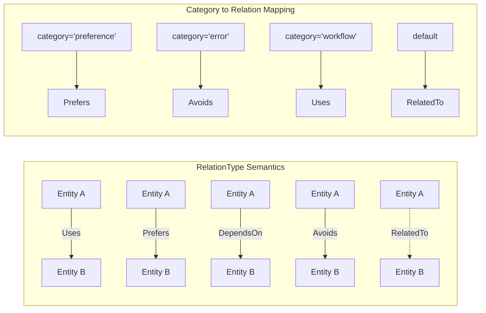

# RelationType

**Type:** technology

### From: knowledge_graph

RelationType defines the semantic vocabulary for describing connections between entities in the knowledge graph, capturing five distinct relationship modalities with clear directional semantics. The Uses relationship indicates tool or language adoption, Prefers captures positive selection decisions, DependsOn represents hard dependencies, Avoids records negative experiences or explicit non-adoption, and RelatedTo provides a generic associative connection. This design reflects careful analysis of software engineering knowledge representation needs, where the same two entities might have different relationship types depending on context—for example, a project might Use Docker while Preferring Podman, or DependOn a library while Avoiding a particular version.

The from_str_lossy method demonstrates pragmatic API design by providing a fallback to RelatedTo for unrecognized relationship strings, preventing parsing failures when encountering data from extended schemas or future versions. The confidence field in the Relationship struct allows for probabilistic relationship inference, acknowledging that automated extraction produces uncertain results. This design supports iterative refinement of relationship accuracy through user feedback or confidence thresholding in retrieval operations.

## Diagram

## External Resources

- [Semantic networks in knowledge representation](https://en.wikipedia.org/wiki/Semantic_network) - Semantic networks in knowledge representation

## Sources

- [knowledge_graph](../sources/knowledge-graph.md)
