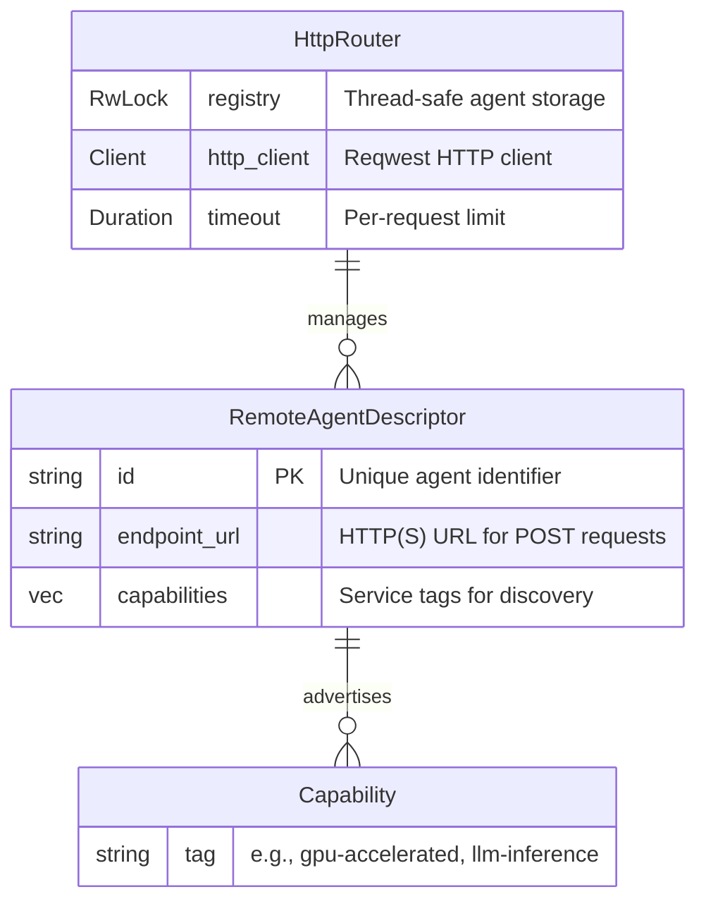

# RemoteAgentDescriptor

**Type:** technology

### From: transport

The `RemoteAgentDescriptor` struct serves as the fundamental metadata carrier for externalized agent instances within the ragent orchestration framework. It encapsulates three critical dimensions of remote agent identity: the `id` field for unique identification matching the server-side agent identity, the `capabilities` vector for semantic capability advertisement enabling intelligent routing decisions, and the `endpoint_url` providing the network location for HTTP-based communication. This tripartite structure reflects industry best practices from service mesh architectures and microservice discovery systems.

The capabilities system implements substring matching semantics, where remote agents advertise tags like `"gpu-accelerated"`, `"llm-inference"`, or `"image-processing"`, and the `HttpRouter::match_agents` method filters registered agents based on required capability intersections. This design supports both precise capability matching and hierarchical categorization through naming conventions. The derive macros for `Debug`, `Clone`, `Serialize`, and `Deserialize` ensure the descriptor can be logged for observability, cloned for registry operations, and persisted or transmitted across network boundaries as needed for distributed configuration management.

The endpoint URL specification expects HTTP or HTTPS URLs capable of accepting POST requests with `application/json` content containing `RemoteAgentRequest` bodies. This contract-based approach decouples the orchestrator from specific agent implementations, allowing any compliant HTTP server to participate in the agent ecosystem regardless of underlying technology stack. The descriptor's design anticipates evolution toward more sophisticated health checking, load balancing, and geographic routing by establishing extensible metadata patterns that can accommodate additional fields without breaking existing serialization contracts.

## Diagram

## External Resources

- [Service discovery patterns in microservices](https://microservices.io/patterns/service-discovery.html) - Service discovery patterns in microservices
- [Service mesh architecture and sidecar patterns](https://docs.openshift.com/container-platform/4.14/service_mesh/v2/ossm-architecture.html) - Service mesh architecture and sidecar patterns

## Sources

- [transport](../sources/transport.md)
