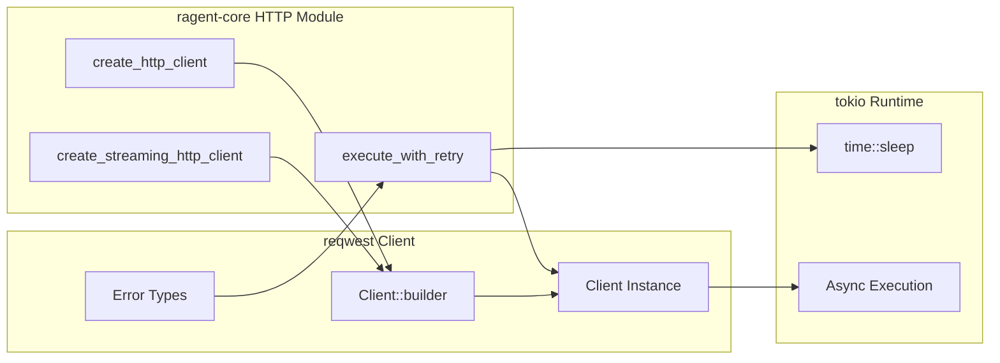

# reqwest

**Type:** technology

### From: http_client

Reqwest is a high-level HTTP client library for Rust that serves as the foundational dependency for this module's HTTP communication capabilities. It provides an ergonomic, asynchronous API built on top of hyper and tokio, offering features like connection pooling, HTTP/2 support, TLS configuration, and request/response handling. The library abstracts away many low-level HTTP implementation details while remaining flexible enough for advanced use cases. In this module, reqwest's `Client::builder()` pattern is extensively utilized to configure custom connection parameters, pool management, and timeout behaviors specific to LLM provider requirements.

The choice of reqwest reflects modern Rust ecosystem preferences for async I/O operations. Its builder pattern allows granular control over client behavior without sacrificing API ergonomics. The module leverages reqwest's built-in error types (`reqwest::Error`) to implement sophisticated retry logic, checking specific error conditions like timeouts, connection failures, and body decoding errors. Reqwest's integration with tokio enables the async/await patterns used throughout the retry execution function, while its HTTP/2 implementation requires careful pool configuration to avoid race conditions in concurrent scenarios.

## Diagram

## External Resources

- [Official reqwest documentation on docs.rs](https://docs.rs/reqwest/latest/reqwest/) - Official reqwest documentation on docs.rs
- [Reqwest GitHub repository and source code](https://github.com/seanmonstar/reqwest) - Reqwest GitHub repository and source code
- [Introduction to reqwest by author Sean McArthur](https://seanmonstar.com/post/178572078878/reqwest) - Introduction to reqwest by author Sean McArthur

## Sources

- [http_client](../sources/http-client.md)

### From: http_request

reqwest is a widely-adopted, ergonomic HTTP client library for Rust, serving as the foundational networking layer for HttpRequestTool. The library provides a high-level async-first API built on top of hyper, Rust's foundational HTTP implementation, with modern features including native TLS support, connection pooling, automatic body decompression, and comprehensive timeout handling. reqwest has become the de facto standard for HTTP operations in the Rust ecosystem, balancing ease of use with performance characteristics suitable for production workloads.

The library's design philosophy emphasizes sensible defaults while permitting extensive customization through builder patterns. HttpRequestTool leverages several core reqwest components: `Client::builder()` for constructing configured clients with timeout settings, `Method` for HTTP verb parsing, `HeaderMap`/`HeaderName`/`HeaderValue` for type-safe header manipulation, and the async request/response lifecycle. The library's integration with Rust's async ecosystem through tokio enables efficient concurrent request handling without blocking agent execution threads.

reqwest's maturity is evidenced by its widespread adoption across the Rust ecosystem, from CLI tools to web services. The library handles complex HTTP concerns transparently, including redirect following, cookie management, and proxy configuration, though HttpRequestTool intentionally configures a minimal client to reduce attack surface. The choice of reqwest over lower-level alternatives like hyper directly reflects HttpRequestTool's design goal of reliability and maintainability in agent systems where HTTP operations may be triggered by potentially untrusted LLM-generated parameters.

### From: webfetch

reqwest is a popular asynchronous HTTP client library for Rust, designed for ergonomic and composable web requests. It builds upon the hyper HTTP library and provides a higher-level API with features like connection pooling, cookie persistence, proxy support, and request/response body streaming. WebFetchTool uses reqwest as its underlying HTTP implementation, configuring it with custom timeouts, redirect policies, and user agent strings to suit the specific needs of agent-based web fetching.

The WebFetchTool implementation demonstrates several reqwest best practices for production use. The `Client::builder()` pattern allows precise configuration of behavior before request execution. The timeout is set using `std::time::Duration::from_secs()` to prevent indefinite waits on unresponsive servers. The redirect policy is explicitly limited to 5 hops using `reqwest::redirect::Policy::limited()`, protecting against infinite redirect loops that could hang the agent. The user agent is customized to identify the ragent system, which is important for web server logging and potential rate limiting decisions by site operators.

reqwest's async support is essential for WebFetchTool's integration into agent systems that may perform multiple concurrent operations. The `.send().await` pattern yields control during network I/O, allowing the async runtime to schedule other tasks. Error handling uses reqwest's rich error types converted through `anyhow` for consistent error propagation. The library's automatic response body handling through `.text().await` simplifies content extraction, while header inspection provides content-type detection for processing decisions. These patterns reflect reqwest's design philosophy of providing both power and usability for Rust HTTP clients.

### From: resolve

Reqwest is a popular higher-level HTTP client library for Rust that builds upon the hyper HTTP library to provide an ergonomic, batteries-included interface for making HTTP requests. Within this resolution module, reqwest is configured with custom timeouts (15 seconds), limited redirects (maximum 5), and a custom user agent string identifying the ragent tool. The library handles the complexities of HTTP protocol negotiation, TLS certificate validation, connection pooling, and response body streaming. The `resolve_url` function demonstrates reqwest's builder pattern for client configuration and its async/await API for fetching remote content. Reqwest supports both async and blocking APIs, automatic JSON serialization, multipart forms, and various authentication mechanisms. It has become one of the most widely-used HTTP clients in the Rust ecosystem, favored for its combination of ease-of-use and configurability for production applications requiring robust HTTP communication.
