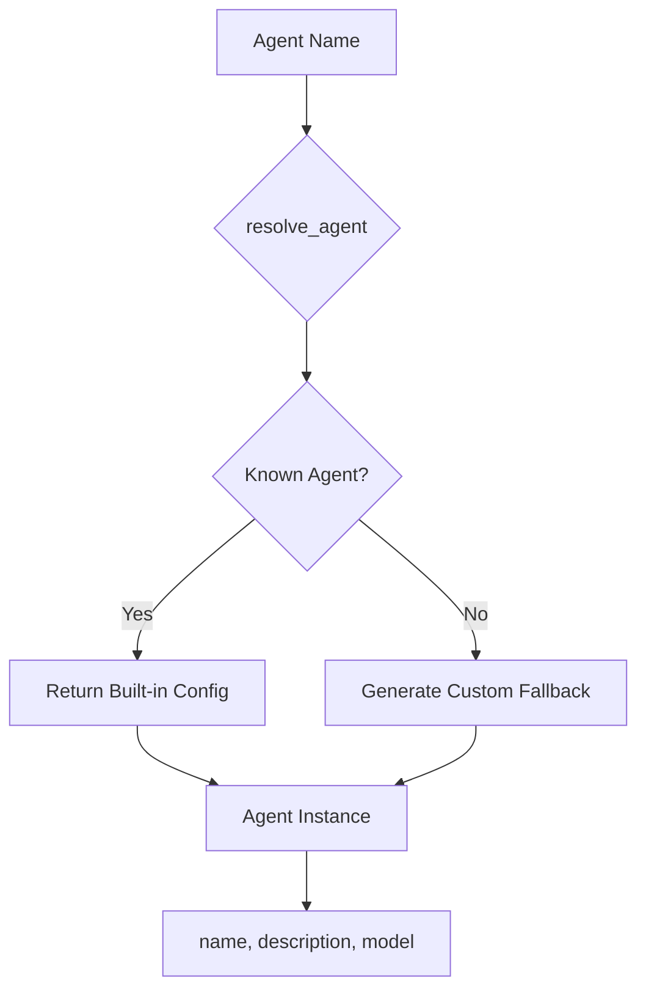

# resolve_agent

**Type:** technology

### From: test_agent

The `resolve_agent` function is a core API component in ragent-core that bridges agent names to fully configured agent instances. This function accepts two parameters: a string slice representing the agent name and a reference to a `Config` instance, returning a `Result` that either contains the resolved agent or an error. The function serves as the primary factory mechanism for agent instantiation within the system, abstracting away the complexity of agent lookup and configuration.

Based on test evidence, `resolve_agent` implements a sophisticated lookup strategy with multiple resolution tiers. For known built-in agents like "general", it returns predefined configurations with complete metadata including name, description, and model specifications. For unknown agents, rather than failing, it implements a fallback mechanism that synthesizes a custom agent configuration, preserving the requested name and providing appropriate descriptive text. This behavior suggests the function maintains an internal registry of built-in agents while supporting dynamic agent creation.

The function's signature and usage patterns indicate it is designed for both programmatic use and potential runtime agent resolution scenarios. By accepting a configuration reference, it allows resolution to be influenced by system-wide settings, enabling customization of agent behavior based on deployment context. The Result return type enforces explicit error handling at compile time, though the actual implementation appears optimized for success cases through its fallback strategy.

## Diagram

## External Resources

- [Rust Result Type - documentation on error handling patterns used by resolve_agent](https://doc.rust-lang.org/std/result/) - Rust Result Type - documentation on error handling patterns used by resolve_agent
- [Factory Method Pattern - design pattern implemented by resolve_agent](https://en.wikipedia.org/wiki/Factory_method_pattern) - Factory Method Pattern - design pattern implemented by resolve_agent

## Sources

- [test_agent](../sources/test-agent.md)
