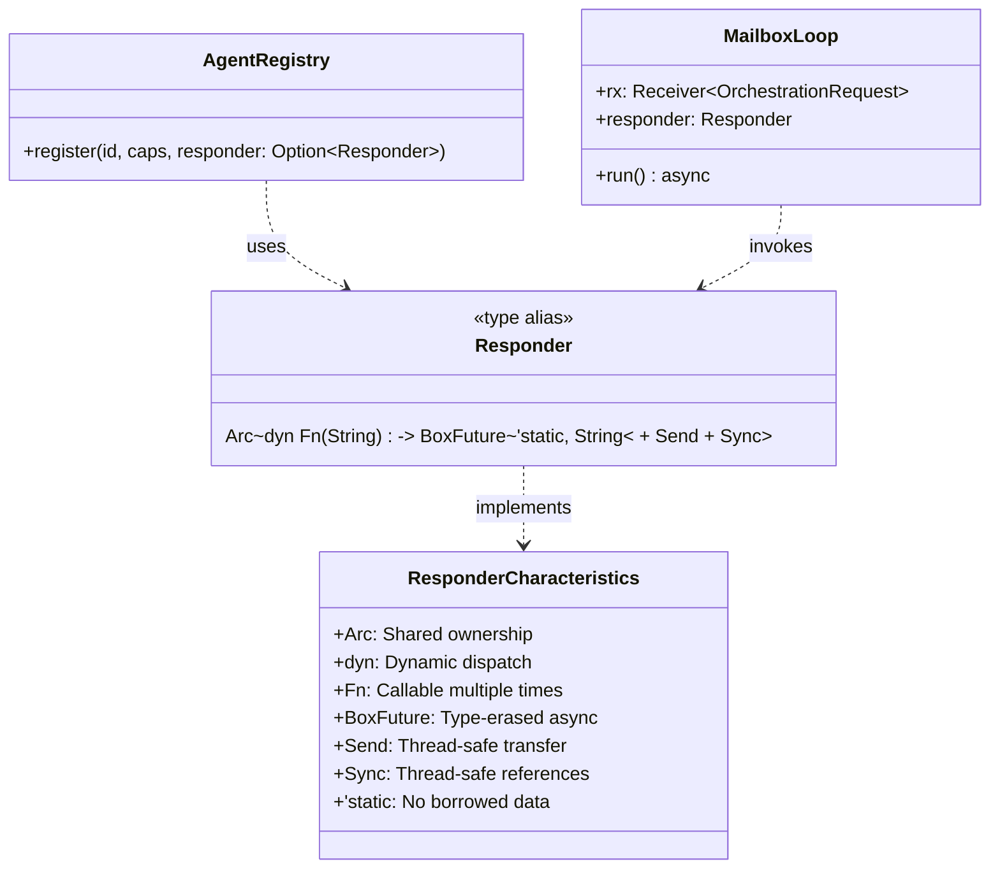

# Responder

**Type:** technology

### From: registry

The Responder type alias defines the callback interface for in-process agent integration, representing a sophisticated use of Rust's type system to create flexible, type-erased async callbacks. Defined as Arc<dyn Fn(String) -> BoxFuture<'static, String> + Send + Sync>, it encapsulates a thread-safe, reference-counted callable that transforms string payloads into asynchronous string responses. This design enables the registry to work with any async processing logic without generics proliferation.

The type construction reveals layered architectural decisions. BoxFuture<'static, String> uses dynamic dispatch to erase specific future types, allowing heterogeneous responders in the same registry while maintaining the 'static lifetime requirement for spawned tasks. The Send + Sync bounds ensure thread safety across Tokio's work-stealing scheduler, and Arc enables shared ownership without lifetime coupling to registration scope. The Fn trait (rather than FnMut or FnOnce) permits multiple invocations, supporting the persistent mailbox processing loop.

When provided during registration, the responder drives automatic mailbox infrastructure creation. The registry constructs an MPSC channel, stores the sender in the AgentEntry, and spawns a dedicated Tokio task that loops receiving OrchestrationRequest messages. For each message, it invokes the responder with the payload, awaits the resulting future, and forwards the response through the one-shot reply channel. This pattern decouples agent implementation from registry mechanics—agents need only provide async processing logic, while the registry handles scheduling, backpressure (via channel bounds), and response routing.

The Option<Responder> parameter in registration enables a dual-mode registry supporting both active agents with processing capabilities and passive entries representing external or manually-managed agents. This flexibility supports hybrid topologies where some agents run in-process with full mailbox integration while others exist as proxies for remote services or future registrations.

## Diagram

## External Resources

- [futures::future::BoxFuture - Type-erased async future for dynamic dispatch](https://docs.rs/futures/latest/futures/future/type.BoxFuture.html) - futures::future::BoxFuture - Type-erased async future for dynamic dispatch
- [Advanced lifetimes and 'static bound in Rust](https://doc.rust-lang.org/book/ch19-05-advanced-lifetimes.html) - Advanced lifetimes and 'static bound in Rust
- [Rust Async Book: Pinning and async trait objects](https://rust-lang.github.io/async-book/04_pinning/01_chapter.html) - Rust Async Book: Pinning and async trait objects

## Sources

- [registry](../sources/registry.md)
