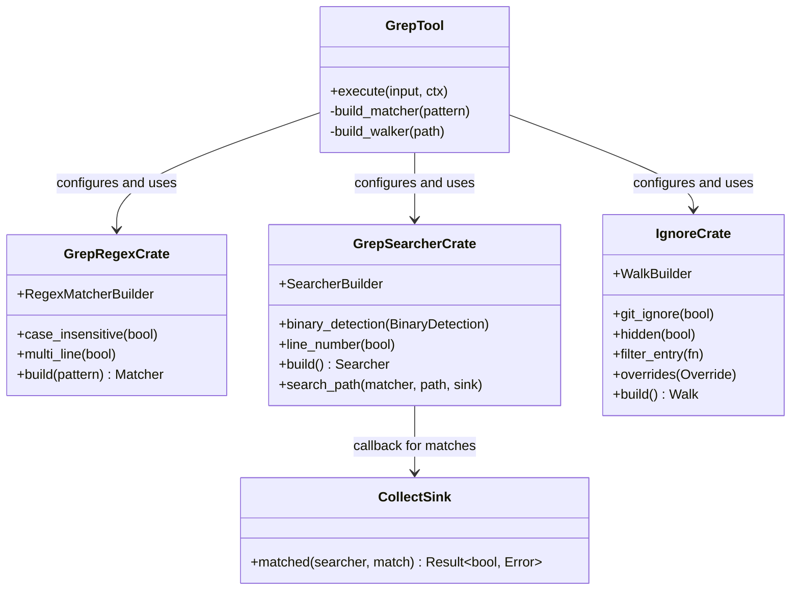

# ripgrep

**Type:** technology

### From: grep

Ripgrep is a line-oriented search tool that recursively searches the current directory for a regex pattern, developed by Andrew Gallant (BurntSushi) as a faster alternative to traditional grep tools like GNU grep and ack. Unlike monolithic implementations, ripgrep is architected as a collection of specialized Rust crates that can be composed independently, making its core functionality available as reusable libraries. The `GrepTool` implementation leverages three key crates from this ecosystem: `grep_regex` for pattern matching, `grep_searcher` for efficient line-oriented searching with encoding detection, and `ignore` for directory traversal that respects `.gitignore`, `.ignore`, and other standard ignore-file formats.

The ripgrep library design prioritizes performance through several strategies: automatic parallelization using SIMD where available, memory-mapped file I/O when beneficial, and careful optimization of the regex engine using finite automata. The `grep_searcher` crate specifically provides automatic binary file detection (avoiding encoding issues and meaningless matches in binary data) and handles multiple text encodings transparently. These characteristics make it exceptionally well-suited for integration into developer tooling and agent systems where correctness and performance on large codebases are critical requirements.

The architectural decision to decompose ripgrep into library crates has enabled a rich ecosystem of tools built on its foundations. The `ignore` crate in particular has become a standard solution for Rust projects needing gitignore-compatible directory walking, handling the complex precedence rules between global git configuration, repository `.gitignore` files, `.git/info/exclude`, and custom ignore patterns. This composability allows `GrepTool` to provide sophisticated behavior—like automatically excluding version control internals and build artifacts—without reimplementing complex ignore-file parsing logic, while maintaining the ability to customize behavior through explicit include/exclude globs.

## Diagram

## External Resources

- [Official ripgrep GitHub repository with comprehensive documentation](https://github.com/BurntSushi/ripgrep) - Official ripgrep GitHub repository with comprehensive documentation
- [Author's detailed writeup on ripgrep design and performance characteristics](https://burntsushi.net/ripgrep/) - Author's detailed writeup on ripgrep design and performance characteristics
- [The regex crate that powers grep_regex pattern matching](https://docs.rs/regex/latest/regex/) - The regex crate that powers grep_regex pattern matching

## Sources

- [grep](../sources/grep.md)
