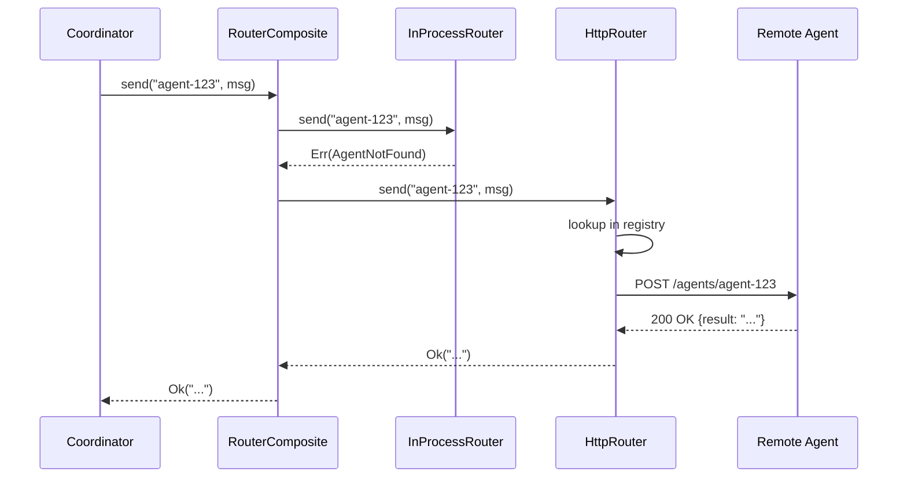

# RouterComposite

**Type:** technology

### From: transport

The `RouterComposite` struct implements the decorator pattern for router composition, enabling sophisticated message routing strategies across heterogeneous transport mechanisms. By maintaining a `Vec<Arc<dyn Router>>`, the composite router treats routing as a prioritized sequence rather than a single fixed destination, allowing systems to implement graceful degradation and performance-optimized delivery paths. This pattern is particularly valuable in distributed systems where local agents should be preferred for latency-sensitive operations while remote agents provide extended capabilities or geographic distribution.

The typical deployment pattern pairs an `InProcessRouter` (for same-process agent communication with minimal overhead) as the primary router with an `HttpRouter` as the fallback mechanism. When the `send` method receives an orchestration message, it iterates through the configured routers in order, attempting delivery with each until one succeeds. This sequential fallback strategy ensures maximum message delivery probability while respecting administrative preferences about transport selection. The implementation carefully preserves error context, capturing the last encountered error when all routers fail, which aids in debugging routing misconfigurations or widespread agent outages.

The design leverages Rust's trait object system with `Arc<dyn Router>` to enable heterogeneous router collections without requiring generic parameters that would propagate through the entire call stack. This type erasure approach simplifies the coordinator's integration with the transport layer while maintaining zero-cost abstractions for the individual router implementations. The `RouterComposite` thus serves as a critical bridging component in hybrid deployment scenarios, seamlessly unifying in-memory agent registries with geographically distributed agent networks under a single coherent routing interface.

## Diagram

## External Resources

- [Decorator pattern - Wikipedia](https://en.wikipedia.org/wiki/Decorator_pattern) - Decorator pattern - Wikipedia
- [Rust trait objects and dynamic dispatch](https://doc.rust-lang.org/book/ch17-02-trait-objects.html) - Rust trait objects and dynamic dispatch
- [Circuit breaker pattern in distributed systems](https://microservices.io/patterns/communication-pattern/circuit-breaker.html) - Circuit breaker pattern in distributed systems

## Sources

- [transport](../sources/transport.md)
