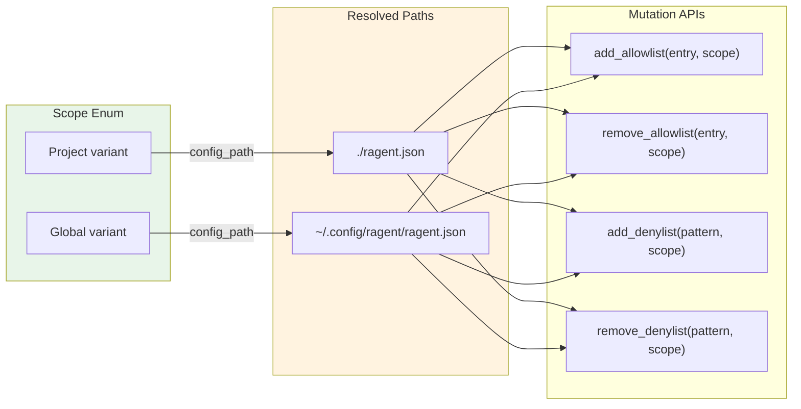

# Scope

**Type:** technology

### From: bash_lists

Scope is an enumeration that defines the persistence target for configuration mutations in ragent's bash policy system, distinguishing between project-local and global user settings. The enum has two variants: Project, which resolves to `./ragent.json` in the current working directory, and Global, which resolves to `~/.config/ragent/ragent.json` using the platform-appropriate configuration directory. This scoping mechanism enables flexible policy management where teams can share baseline security rules through version-controlled project configs while individuals maintain personal overrides or additions in their global config.

The implementation includes a config_path method that performs the filesystem path resolution, using the dirs crate for cross-platform global config directory detection. This design pattern of separating semantic scope from concrete paths improves testability and would allow future extensions like workspace-level or repository-level scopes. The Scope type appears in all mutation APIs (add_allowlist, remove_allowlist, etc.), making the persistence target an explicit, required decision for every policy change. This prevents accidental modifications to the wrong configuration file and supports commands like `/bash add --global curl` for intentional global policy updates.

## Diagram

## External Resources

- [dirs crate documentation for platform-appropriate configuration directory detection](https://docs.rs/dirs/latest/dirs/) - dirs crate documentation for platform-appropriate configuration directory detection
- [Rust enum documentation - the language feature used for Scope definition](https://doc.rust-lang.org/rust-by-example/custom_types/enum.html) - Rust enum documentation - the language feature used for Scope definition

## Sources

- [bash_lists](../sources/bash-lists.md)
