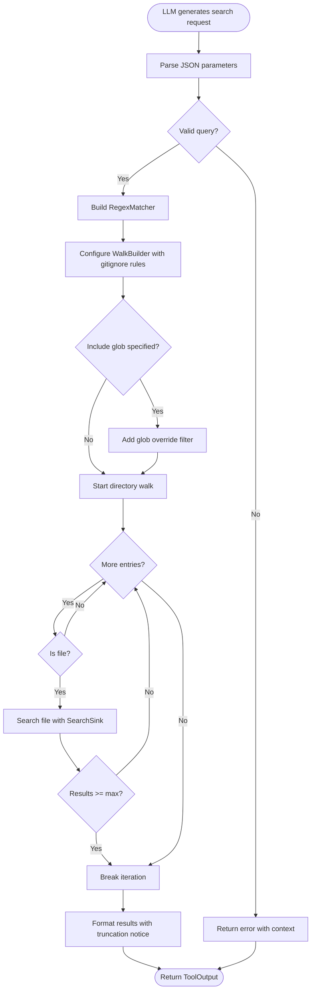

# SearchTool

**Type:** technology

### From: search

SearchTool is a public struct representing a model-friendly code search tool that serves as an ergonomic interface to ripgrep functionality. This implementation addresses a specific pain point in LLM tool systems: smaller open-weight models frequently hallucinate a generic 'search' tool when they need to find code patterns, producing parameters like 'query', 'path', and 'max_results' that don't match the more complex interface of the underlying GrepTool. Rather than forcing these models to learn a different parameter schema, SearchTool accepts their natural output and forwards it to the same ripgrep-backed search engine.

The struct itself is a zero-sized type (unit struct) that implements the Tool trait via async_trait, enabling asynchronous execution within the broader tool framework. Its design prioritizes simplicity and predictability for LLM consumers while maintaining full access to powerful search capabilities. The tool supports case-insensitive searching, glob-based file filtering, and configurable result limits up to 500 matches per call. It respects standard ignore patterns including .gitignore, .git/info/exclude, and global git ignore files, ensuring that searches focus on relevant source code rather than generated artifacts or dependencies.

SearchTool operates within a permission category of "file:read", indicating its read-only nature and appropriate access controls. The execute method orchestrates a complex pipeline: parsing and validating input parameters, building a regex matcher with appropriate case sensitivity settings, configuring a directory walker with ignore-aware filtering, and executing searches across all matching files while collecting results in a thread-safe manner. The implementation demonstrates mature Rust patterns for error handling with anyhow's Context trait for rich error messages, and careful resource management through Arc and Mutex for shared state across the search iteration.

## Diagram

## External Resources

- [grep_searcher crate documentation - the underlying search engine](https://docs.rs/grep-searcher/latest/grep_searcher/) - grep_searcher crate documentation - the underlying search engine
- [ignore crate documentation - gitignore-aware directory walking](https://docs.rs/ignore/latest/ignore/) - ignore crate documentation - gitignore-aware directory walking
- [async_trait crate for ergonomic async trait implementations](https://docs.rs/async-trait/latest/async_trait/) - async_trait crate for ergonomic async trait implementations

## Sources

- [search](../sources/search.md)
