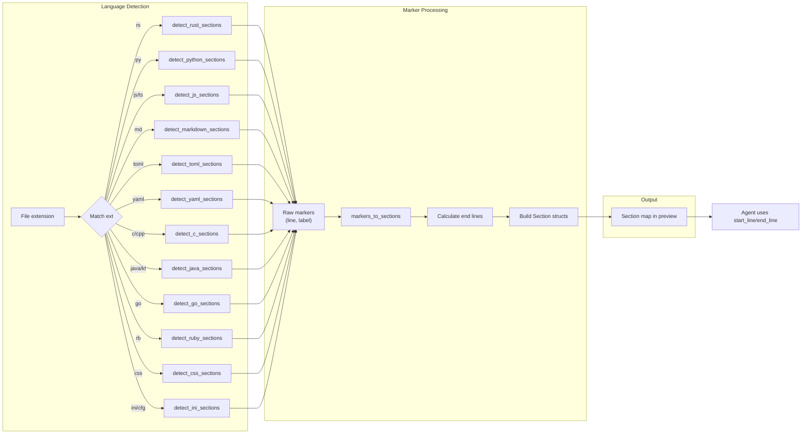

# Section Detection System

**Type:** technology

### From: read

The section detection system in read.rs implements a language-aware structural analysis capability that transforms raw file content into navigable semantic units. This system is specifically designed to address the challenge of large file handling in AI agent contexts, where loading an entire 10,000-line source file into a context window would be wasteful and potentially counterproductive. When a file exceeds 100 lines and no specific line range is requested, the tool activates its section detection logic to provide a high-level overview of the file's organization, enabling targeted subsequent access.

The detection architecture follows an extensible pattern matching approach where file extensions map to specialized detection functions. Twelve distinct language handlers are implemented: Rust (`detect_rust_sections`), Markdown (`detect_markdown_sections`), Python (`detect_python_sections`), JavaScript/TypeScript (`detect_js_sections`), TOML (`detect_toml_sections`), YAML (`detect_yaml_sections`), INI/configuration files (`detect_ini_sections`), C/C++ (`detect_c_sections`), Java/Kotlin (`detect_java_sections`), Go (`detect_go_sections`), Ruby (`detect_ruby_sections`), and CSS/SCSS/Less (`detect_css_sections`). Each handler implements language-specific heuristics to identify meaningful structural boundaries. For example, Rust detection recognizes function definitions through patterns like `pub fn`, `async fn`, `pub(crate) fn`, as well as struct, enum, trait, impl, and module declarations. The detection uses prefix matching on trimmed lines combined with delimiter extraction to capture meaningful labels while avoiding false positives from comments or string literals.

The `markers_to_sections` function converts raw detection results into contiguous, non-overlapping `Section` structs that represent the complete file structure. Each section records its 1-based start and end line numbers along with a descriptive label extracted from the source code. The conversion logic handles edge cases such as empty marker lists and ensures that sections span from their starting marker to either the next marker's starting line minus one, or the end of the file for the final section. This normalized representation enables consistent presentation across all supported languages and facilitates precise line-range calculations for subsequent tool invocations. The section labels preserve original source formatting where meaningful (like Markdown headers) or extract signature information (like function declarations), providing agents with sufficient context to make informed navigation decisions.

## Diagram

## External Resources

- [Tree-sitter parsing library (production-grade alternative approach)](https://tree-sitter.github.io/tree-sitter/) - Tree-sitter parsing library (production-grade alternative approach)
- [Abstract syntax tree concepts in compiler design](https://en.wikipedia.org/wiki/Abstract_syntax_tree) - Abstract syntax tree concepts in compiler design

## Sources

- [read](../sources/read.md)
