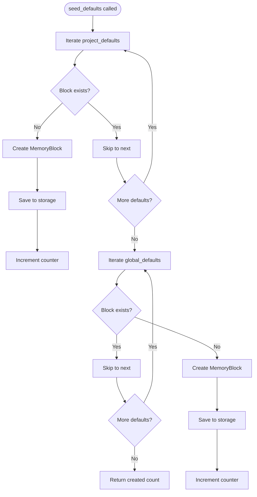

# seed_defaults

**Type:** technology

### From: defaults

The `seed_defaults` function serves as the primary public API for initializing default memory blocks within the ragent memory system. This function accepts a trait object implementing `BlockStorage` and a `PathBuf` representing the working directory, returning a count of newly created blocks. The function's design reflects careful consideration of idempotency and data safety—it checks for existing blocks before creation and never overwrites user-defined content. Internally, the function maintains a counter of created blocks and processes two distinct categories of defaults: project-scoped blocks stored in the local project directory and global-scoped blocks stored in a shared location.

The implementation demonstrates sophisticated use of Rust's error handling patterns, particularly the combination of `Result::ok()` and `Option::flatten()` to gracefully handle cases where blocks may or may not exist. For each potential default block, the function first attempts to load an existing entry; only when this returns `None` does it proceed to create a new `MemoryBlock` with the predefined label, description, and content. The builder-style API of `MemoryBlock`—using methods like `with_description` and `with_content`—enables clean, fluent construction of block objects. This pattern separation between project and global scopes enables flexible deployment scenarios where agents can maintain consistent personalities across projects while adapting project-specific conventions as needed.

The function's return value of `usize` provides immediate feedback about initialization progress, allowing calling code to determine whether this represents a first-time setup or a no-op re-execution. This design supports automated workflows where `seed_defaults` can be invoked repeatedly without risk of data loss or duplication. The trait-based storage abstraction ensures the function remains agnostic to underlying storage implementations, whether file-based, database-backed, or remote storage systems, promoting testability and architectural flexibility within the broader ragent ecosystem.

## Diagram

## External Resources

- [Rust Result type documentation for error handling patterns used in seed_defaults](https://doc.rust-lang.org/std/result/enum.Result.html) - Rust Result type documentation for error handling patterns used in seed_defaults
- [Rust Option type documentation explaining flatten and other combinators](https://doc.rust-lang.org/std/option/enum.Option.html) - Rust Option type documentation explaining flatten and other combinators

## Sources

- [defaults](../sources/defaults.md)
