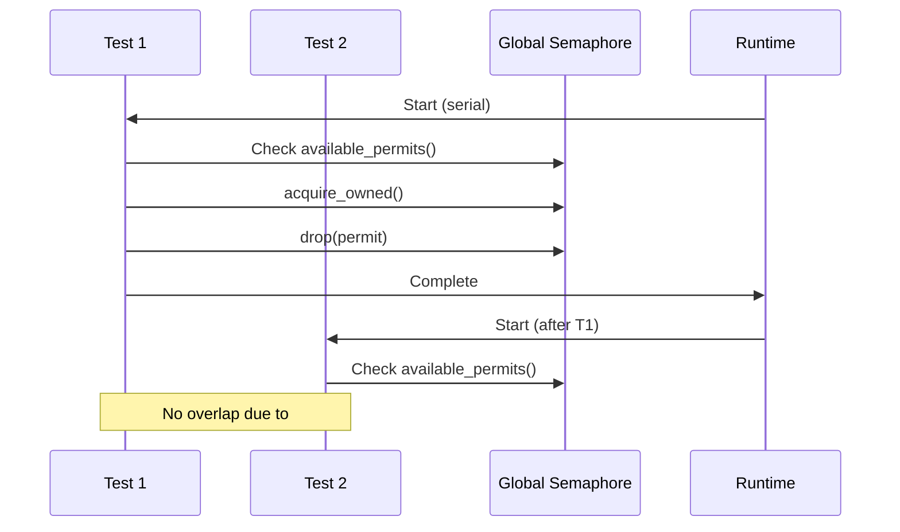

# serial_test

**Type:** technology

### From: resource

serial_test is a Rust testing utility that provides procedural macros for controlling test execution order and preventing concurrent test runs. In this codebase, the #[serial] attribute is applied to all async tests that interact with global semaphore state, ensuring that tests execute sequentially rather than in parallel. This is essential because the semaphores are global static resources with shared state; concurrent test execution would cause tests to interfere with each other's permit counts, leading to flaky or incorrect assertions. The crate integrates with Tokio's test runtime and provides clean semantics for test isolation in scenarios where traditional test isolation through temporary resources is impractical. The use of serial_test here reflects a pragmatic approach to testing global state while maintaining test reliability.

## Diagram

## External Resources

- [serial_test crate documentation](https://docs.rs/serial_test/latest/serial_test/) - serial_test crate documentation
- [Tokio test attribute and async test patterns](https://docs.rs/tokio/latest/tokio/attr.test.html) - Tokio test attribute and async test patterns

## Sources

- [resource](../sources/resource.md)
