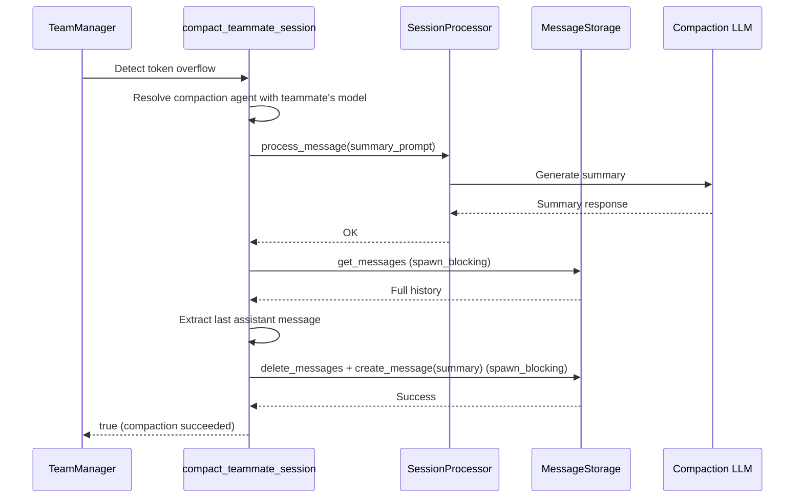

# Session Compaction Agent

**Type:** technology

### From: manager

The session compaction subsystem addresses a critical operational challenge in long-running AI agent deployments: context window exhaustion. As agent sessions accumulate message history, they eventually encounter token limits imposed by underlying language model providers (Anthropic Claude, OpenAI GPT, GitHub Copilot). The `compact_teammate_session` function implements an intelligent recovery mechanism that preserves essential context while dramatically reducing token count through AI-generated summarization.

The compaction workflow operates through a sophisticated multi-step process. First, it resolves a specialized "compaction" agent configuration, preferring the teammate's active model to ensure provider compatibility—this is crucial when teams mix providers (e.g., Anthropic for main agents, OpenAI for specific tasks). The compaction agent receives a carefully crafted prompt instructing it to produce a concise representation preserving all important context, decisions, code changes, file paths, and outstanding tasks. After executing this summary generation through the `SessionProcessor`, the system extracts the assistant's summary response and performs atomic history replacement: deleting all existing messages and inserting a single synthetic message containing the compacted context with a metadata prefix indicating the compaction event.

Error handling throughout reflects the system's resilience priorities. Compaction failures—whether LLM call errors, missing assistant responses, or storage operation failures—are logged with `tracing::warn` but never panic; the function returns `false` to indicate partial success, allowing callers to retry the original operation even with partially compacted context. The atomic replacement ensures session consistency, preventing corruption from interrupted compactions. This architecture enables agents to operate indefinitely on bounded context windows, with compaction triggered automatically when `is_token_overflow_error` detects provider-specific error patterns ("prompt token count exceeds", "context_length_exceeded", "maximum context length").

## Diagram

## External Resources

- [Anthropic Claude context window documentation](https://docs.anthropic.com/claude/docs/context-window) - Anthropic Claude context window documentation
- [OpenAI Chat Completions API with context window limits](https://platform.openai.com/docs/guides/gpt/chat-completions-api) - OpenAI Chat Completions API with context window limits

## Sources

- [manager](../sources/manager.md)
