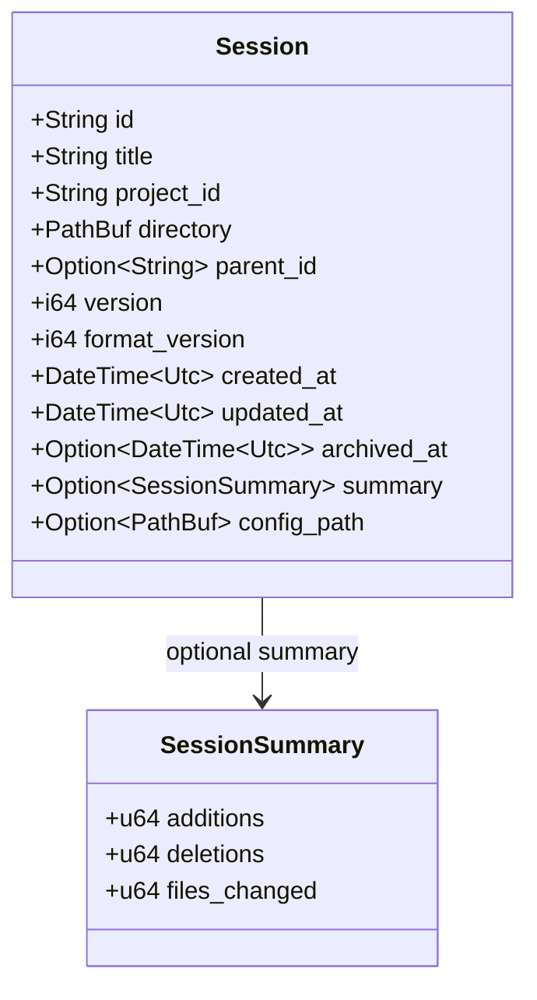

# Session

**Type:** technology

### From: mod

The `Session` struct serves as the fundamental data structure representing an ongoing conversation between a user and an AI agent within the ragent framework. Each session is permanently bound to a specific working directory on the filesystem, establishing a clear scope for file operations, code modifications, and context management. The struct maintains comprehensive metadata including a UUIDv4-generated unique identifier, human-readable title, project association, optional parent session reference for fork semantics, and optimistic concurrency version tracking.

The session structure incorporates temporal tracking through `DateTime<Utc>` fields marking creation, last modification, and archival events. A significant design consideration is the `format_version` field, which enables backward compatibility as the data model evolves across software versions. The optional `SessionSummary` field aggregates quantitative metrics about changes made during the session, including lines added, deleted, and files modified, providing accountability and analytics capabilities. The `config_path` field captures the configuration context at session creation, enabling validation when resuming interrupted sessions.

Session forking is supported through the `parent_id` field, allowing derivative conversations to inherit context while maintaining provenance. This enables workflows such as exploring alternative approaches from a common baseline or creating temporary experimental branches. The struct derives standard traits including `Debug`, `Clone`, `Serialize`, and `Deserialize`, ensuring it can be logged, duplicated, and persisted transparently. The design reflects patterns from conversation-based AI systems like OpenAI's Assistants API and LangChain's memory management, adapted for local-first agent execution with filesystem integration.

## Diagram

## External Resources

- [chrono DateTime documentation for UTC timestamp handling](https://docs.rs/chrono/latest/chrono/struct.DateTime.html) - chrono DateTime documentation for UTC timestamp handling
- [UUID generation for session identifiers](https://docs.rs/uuid/latest/uuid/struct.Uuid.html) - UUID generation for session identifiers
- [Serde serialization framework for Rust](https://serde.rs/) - Serde serialization framework for Rust

## Sources

- [mod](../sources/mod.md)
