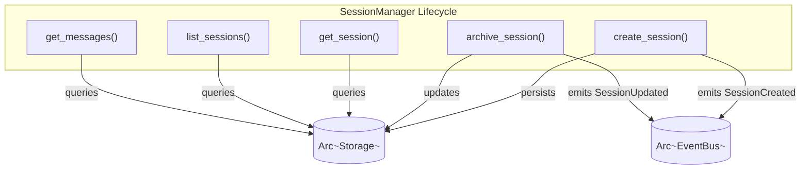

# SessionManager

**Type:** technology

### From: mod

The `SessionManager` struct implements the repository pattern for session lifecycle management, serving as the primary interface between application logic and persistent storage. It encapsulates two critical dependencies: an `Arc<Storage>` providing thread-safe access to the SQLite backend, and an `Arc<EventBus>` enabling asynchronous notification of state changes. This architecture decouples session operations from their side effects, allowing the manager to focus on business logic while delegating persistence and event distribution to specialized components.

The manager provides a complete CRUD interface including `create_session`, `get_session`, `list_sessions`, and `archive_session` operations, each returning `anyhow::Result` for ergonomic error propagation. Session creation generates UUIDv4 identifiers, establishes timestamps, and emits `SessionCreated` events. The `list_sessions` method specifically filters archived sessions, presenting an active-only view while preserving historical data. Message retrieval through `get_messages` demonstrates the manager's role in coordinating related but distinct domain entities.

The implementation includes careful attention to resource management through the `Drop` trait, which provides a hook for graceful shutdown scenarios. While current implementation relies on SQLite's automatic connection closing, the explicit drop handler enables future enhancement such as async cleanup or distributed coordination. The `const fn new` and `const fn storage` methods enable compile-time optimization where possible. Documentation examples in rustdoc format demonstrate usage patterns with in-memory storage for testing, reflecting test-driven development practices. The design parallels session managers in web frameworks like Actix-web's session middleware and Tower's service layers, adapted for stateful agent interactions.

## Diagram

## External Resources

- [Rust Arc (atomic reference counting) for thread-safe shared ownership](https://doc.rust-lang.org/std/sync/struct.Arc.html) - Rust Arc (atomic reference counting) for thread-safe shared ownership
- [Anyhow error handling library for idiomatic Rust errors](https://docs.rs/anyhow/latest/anyhow/) - Anyhow error handling library for idiomatic Rust errors
- [Rust Drop trait for resource cleanup](https://doc.rust-lang.org/std/ops/trait.Drop.html) - Rust Drop trait for resource cleanup

## Sources

- [mod](../sources/mod.md)
