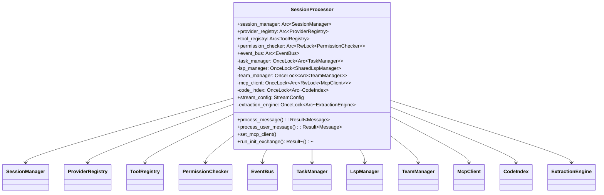

# SessionProcessor

**Type:** technology

### From: processor

The `SessionProcessor` struct serves as the central orchestration engine for agentic conversations within the ragent system. It holds shared references to all major subsystems including session persistence, LLM provider management, tool registries, permission checking, and event broadcasting. The design employs `Arc` (atomic reference counting) for thread-safe shared ownership across asynchronous boundaries, enabling multiple concurrent sessions while maintaining centralized resource management.

The processor's architecture demonstrates sophisticated dependency management through `std::sync::OnceLock` fields, which defer initialization of circular dependencies until runtime. This pattern appears in `task_manager`, `lsp_manager`, `team_manager`, `mcp_client`, `code_index`, and `extraction_engine`. The `OnceLock` type provides thread-safe one-time initialization, allowing the processor to be constructed before its dependent components are fully ready, then populated later when the dependency graph resolves. This avoids complex constructor ordering problems while maintaining type safety.

The `stream_config` field holds timeout, retry, and backoff parameters for LLM streaming operations, indicating production-grade resilience engineering. The processor's public API centers on `process_message` and `process_user_message` methods, with the latter supporting multimodal inputs including image attachments. Additional specialized methods like `set_mcp_client` for dynamic MCP tool registration and `run_init_exchange` for AGENTS.md acknowledgment demonstrate the system's extensibility for various agent initialization patterns.

## Diagram

## External Resources

- [Rust OnceLock documentation for deferred initialization patterns](https://doc.rust-lang.org/std/sync/struct.OnceLock.html) - Rust OnceLock documentation for deferred initialization patterns
- [Tokio shared state patterns with Arc](https://tokio.rs/tokio/tutorial/shared-state) - Tokio shared state patterns with Arc

## Sources

- [processor](../sources/processor.md)

### From: invoke

SessionProcessor serves as the central orchestration engine for message processing within the ragent-core agent system, referenced as a dependency for forked skill execution. While its full implementation resides outside this module, the invoke_forked_skill function demonstrates its critical role in subagent lifecycle management: creating isolated sessions through session_manager, processing skill prompts through process_message, and coordinating cancellation through shared AtomicBool flags. The processor implements a reactor pattern for asynchronous message handling, enabling concurrent skill execution while maintaining session state isolation.

The architectural relationship between SessionProcessor and skill invocation reveals sophisticated concurrency design. The processor reference passed to invoke_forked_skill is borrowed rather than owned, allowing multiple forked executions to share the same underlying infrastructure without cloning heavy connection pools or configuration state. The cancel_flag Arc<AtomicBool> enables cooperative cancellation across the parent-fork boundary—critical for responsive systems where long-running skills must respect user interruption. The process_message method accepts explicit Agent configuration, supporting dynamic agent resolution based on skill-specified fork_agent preferences.

Historical evolution of this pattern reflects growing sophistication in AI agent frameworks. Early implementations often coupled session management directly to network connections or process boundaries, limiting flexibility. The SessionProcessor abstraction separates session semantics from transport concerns, enabling in-memory testing, mocked execution environments, and hybrid local-remote deployment configurations. The specific integration point in invoke_forked_skill—where processor.session_manager.create_session() yields a forked context—demonstrates how modern agent systems compose orthogonal concerns (session management, agent configuration, model selection) through layered abstraction rather than monolithic design.
