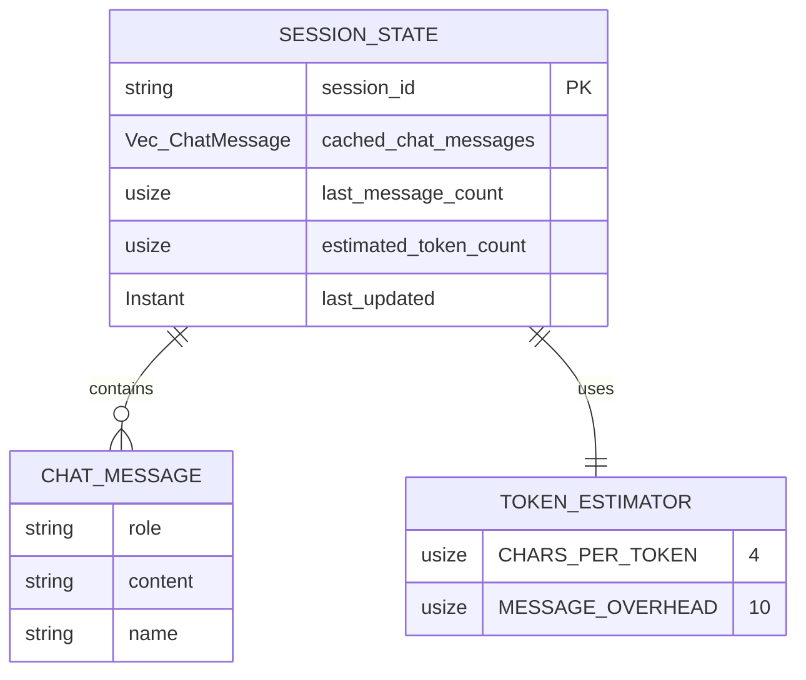

# SessionState

**Type:** technology

### From: cache

The SessionState struct implements incremental history management for chat sessions, addressing a critical performance bottleneck in LLM applications where message history can grow large and expensive to process. Rather than recomputing the entire conversation state on each access, SessionState maintains a cached vector of ChatMessage objects alongside metadata about when the cache was last updated and how many messages were present at that time. This allows the system to detect when new messages have been added and only process the incremental delta.

The struct tracks multiple metrics essential for LLM session management. The `cached_chat_messages` field stores the converted message representation used for LLM API calls, while `last_message_count` enables quick detection of history changes. The `estimated_token_count` field maintains a running total of token consumption, critical for context window management. The `last_updated` timestamp provides observability into cache freshness, and the `session_id` ensures state isolation between concurrent sessions.

A key capability is the `should_compact()` method, which implements proactive context window management. By triggering compaction at 80% of the context window threshold, the system prevents emergency truncation that could lose important conversation context. The `clear()` method provides clean reset semantics for operations like history compaction or session reset. This design pattern reflects the operational realities of production LLM systems where token budgets are constrained and conversation history must be managed carefully to maintain coherence while staying within API limits.

## Diagram

## External Resources

- [OpenAI API documentation on conversation state management](https://platform.openai.com/docs/guides/chat-completions/managing-conversation-state) - OpenAI API documentation on conversation state management
- [OpenAI's tiktoken library for accurate token counting](https://github.com/openai/tiktoken) - OpenAI's tiktoken library for accurate token counting
- [Rust Instant type for monotonic timestamps](https://doc.rust-lang.org/std/time/struct.Instant.html) - Rust Instant type for monotonic timestamps

## Sources

- [cache](../sources/cache.md)
