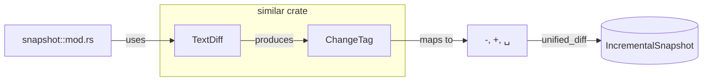

# similar

**Type:** technology

### From: mod

The `similar` crate is a high-performance Rust library for text diffing and comparison operations, serving as the foundational dependency for the ragent snapshot module's unified diff generation capabilities. Developed by Armin Ronacher (creator of Flask and other influential open source projects), similar provides advanced algorithms for computing differences between text sequences with particular optimization for source code and structured text. The module specifically utilizes `TextDiff` for line-oriented comparison and `ChangeTag` for categorizing modification types, enabling precise capture of textual changes with minimal overhead.

Within the snapshot system, similar's `TextDiff::from_lines` method performs the heavy lifting of identifying insertions, deletions, and unchanged lines between file versions. The crate's `grouped_ops` function implements context windowing—grouping nearby changes with configurable context lines (set to 3 in this implementation)—producing output compatible with the unified diff format recognized by patch tools and version control systems worldwide. The `iter_changes` method provides fine-grained access to individual modifications tagged with `ChangeTag::Delete`, `ChangeTag::Insert`, or `ChangeTag::Equal` variants, which the module maps to standard `-`, `+`, and ` ` line prefixes.

The choice of similar over alternatives like `diff-rs` or `prettydiff` reflects requirements for both performance and format compatibility in production agent workflows. Similar's algorithmic foundation builds upon Myers' diff algorithm with optimizations for common cases, delivering O(ND) complexity where N and D represent file lengths and edit distance respectively. This performance characteristic is crucial for agent sessions that may process large source files frequently. The crate's minimal dependency tree and mature API stability make it suitable for foundational infrastructure like ragent-core, where reliability and maintainability outweigh experimental features.

## Diagram

## External Resources

- [Similar crate documentation and API reference](https://docs.rs/similar/latest/similar/) - Similar crate documentation and API reference
- [Similar GitHub repository with source and examples](https://github.com/mitsuhiko/similar) - Similar GitHub repository with source and examples
- [Introduction to Myers' diff algorithm](https://blog.robertelder.org/diff-algorithm/) - Introduction to Myers' diff algorithm

## Sources

- [mod](../sources/mod.md)
