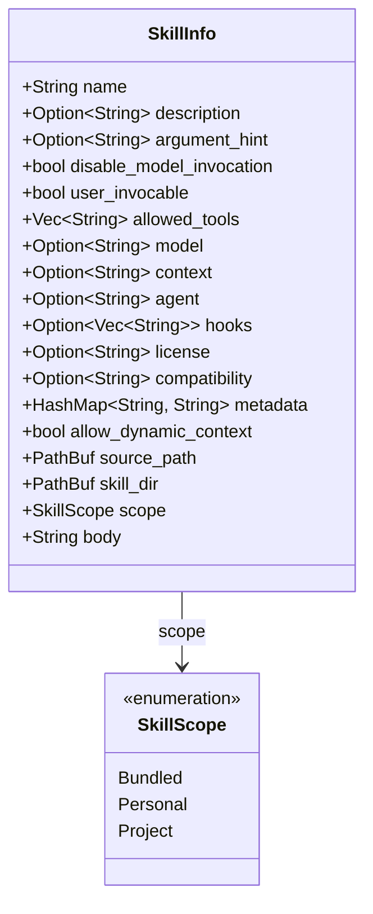

# SkillInfo

**Type:** technology

### From: bundled

SkillInfo is the central data structure in ragent's skill system, representing a reusable, invocable capability within the AI agent framework. This struct encapsulates all metadata and configuration required to define, validate, and execute a skill, including its name, description, argument hints, invocation permissions, allowed tools, and execution body. The structure is designed for flexibility and extensibility, supporting optional fields for model specifications, context requirements, agent assignments, hooks, licensing, compatibility information, and custom metadata through a HashMap.

The architecture of SkillInfo reflects careful consideration of security boundaries and operational contexts. Key boolean flags include `user_invocable` and `disable_model_invocation`, which control who or what can trigger the skill—enforcing separation between human-initiated and autonomous AI operations. The `allowed_tools` field implements an explicit permission system where each skill must declare its required capabilities, preventing unauthorized access to sensitive operations. The struct also tracks provenance through `source_path` and `skill_dir`, enabling skill reloading and workspace-aware behavior. The `scope` field implements ragent's priority-based override system, with variants including Bundled, Personal, and Project levels.

SkillInfo instances are typically constructed through factory functions like `make_bundled_skill`, which applies sensible defaults while allowing customization. The struct supports serialization and deserialization for persistent skill storage, dynamic loading from filesystem paths, and runtime introspection. Its design balances compile-time safety through Rust's type system with runtime flexibility for user-defined skills, making it suitable for both built-in capabilities and community-contributed extensions.

## Diagram

## External Resources

- [Rust HashMap documentation - used for SkillInfo's extensible metadata field](https://doc.rust-lang.org/std/collections/struct.HashMap.html) - Rust HashMap documentation - used for SkillInfo's extensible metadata field
- [Rust PathBuf documentation - used for source and skill directory tracking](https://doc.rust-lang.org/std/path/struct.PathBuf.html) - Rust PathBuf documentation - used for source and skill directory tracking

## Sources

- [bundled](../sources/bundled.md)
