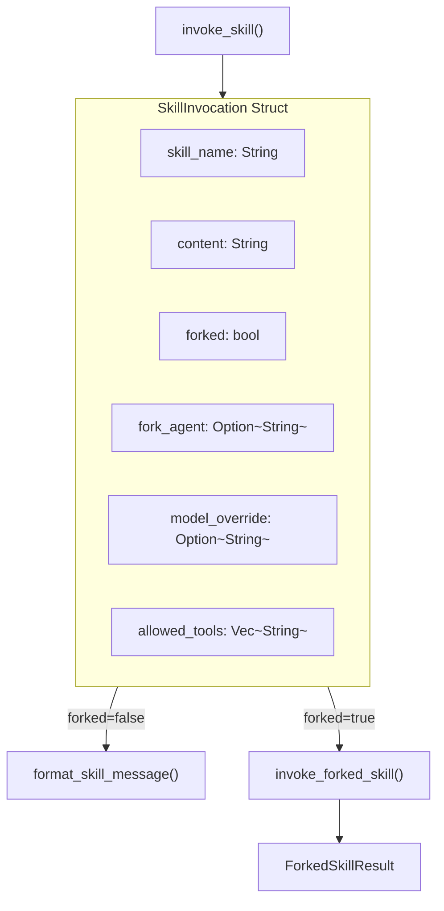

# SkillInvocation

**Type:** technology

### From: invoke

The SkillInvocation struct serves as the primary result type for skill execution within the ragent-core framework, representing the fully processed output of a skill ready for integration into agent conversations. This struct encapsulates five critical fields: the skill_name for provenance tracking, the content containing argument-substituted and context-processed skill body, a forked boolean flag indicating isolated execution requirements, fork_agent specifying which subagent type should handle forked execution, and model_override for per-skill LLM configuration. The design reflects a careful balance between flexibility and explicit control—dynamic context injection requires explicit opt-in via SkillInfo.allow_dynamic_context, preventing accidental command execution.

The struct's architecture enables sophisticated multi-modal skill execution patterns. When forked is true, the invocation bypasses direct content injection and instead triggers the invoke_forked_skill pathway, creating an isolated sub-session with fresh conversation history. The allowed_tools field implements a capability-based security model where skills can pre-authorize specific tool categories without requiring interactive permission prompts. The model_override supports both slash and colon delimiter formats (anthropic/claude-haiku and anthropic:claude-haiku), accommodating varying configuration conventions across deployment environments. Clone derivation enables efficient result sharing across async boundaries without ownership transfer.

Historical context for this design emerges from early agent systems where skill execution was either fully inline (risking conversation pollution) or fully external (losing contextual awareness). The SkillInvocation abstraction bridges this gap by making execution mode a property of the invocation result rather than a global configuration, allowing the same skill definition to be invoked differently based on runtime context. The comprehensive field coverage—including response formatting hints through skill_name and security boundaries through allowed_tools—supports the full lifecycle from invocation through LLM message preparation without requiring additional database queries or configuration lookups.

## Diagram

## External Resources

- [anyhow crate for flexible error handling in Rust](https://docs.rs/anyhow/latest/anyhow/) - anyhow crate for flexible error handling in Rust
- [Tokio async runtime powering the skill execution](https://tokio.rs/) - Tokio async runtime powering the skill execution

## Sources

- [invoke](../sources/invoke.md)
