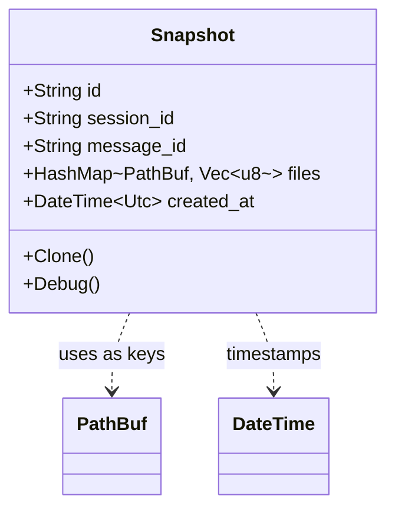

# Snapshot

**Type:** product

### From: mod

The `Snapshot` struct serves as the foundational data structure for capturing point-in-time file system state within the ragent agent session framework. It encapsulates a complete, self-contained record of file contents at a specific moment, enabling reliable restoration and historical tracking of session state. The struct comprises five fields: a UUID-based `id` for unique identification, `session_id` and `message_id` strings that establish temporal and contextual relationships within agent conversations, a `files` HashMap that maps absolute file paths to their raw byte vectors, and a `created_at` timestamp using Chrono's UTC datetime for chronological ordering.

The design philosophy behind `Snapshot` prioritizes completeness and simplicity over efficiency for the base case—every file in the scope is stored in full, ensuring that restoration operations never require reconstruction from multiple sources. This approach eliminates the complexity of dependency chains that plague some versioning systems, where restoring a specific state might require traversing multiple delta layers. The use of `PathBuf` keys in the files map provides cross-platform path handling, while `Vec<u8>` values preserve exact byte-level fidelity without assumptions about text encoding, making the structure suitable for both source code and binary artifacts.

In practice, `Snapshot` instances are created through the `take_snapshot` function, which filters for existing regular files and silently skips inaccessible entries. This defensive behavior ensures that snapshot operations are resilient to race conditions and temporary file disappearance. The struct derives `Debug` and `Clone` traits, supporting logging and duplication workflows essential for testing and multi-branch session scenarios. The complete capture approach makes `Snapshot` particularly suitable as a base reference point for incremental deltas, where its unambiguous full content provides the necessary foundation for computing precise changes.

## Diagram

## External Resources

- [Chrono DateTime documentation for UTC timestamp handling](https://docs.rs/chrono/latest/chrono/struct.DateTime.html) - Chrono DateTime documentation for UTC timestamp handling
- [Rust PathBuf for cross-platform path management](https://doc.rust-lang.org/std/path/struct.PathBuf.html) - Rust PathBuf for cross-platform path management
- [UUID generation for unique snapshot identifiers](https://docs.rs/uuid/latest/uuid/struct.Uuid.html) - UUID generation for unique snapshot identifiers

## Sources

- [mod](../sources/mod.md)
