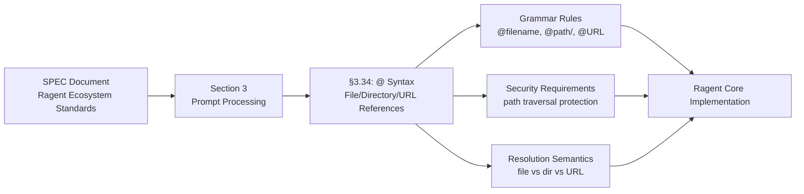

# SPEC §3.34

**Type:** technology

### From: mod

SPEC §3.34 is the formal specification that defines the `@` syntax for inline file, directory, and URL references within the Ragent ecosystem. Specifications like this serve as architectural contracts, ensuring consistent behavior across implementations and versions. Section 3.34 specifically addresses what has become a critical pattern in AI-assisted development: the ability to seamlessly incorporate external context into prompts without breaking conversational flow. The specification likely details grammar rules for valid reference patterns, encoding expectations, security considerations (such as path traversal prevention), and resolution semantics for different resource types. By codifying these behaviors, SPEC §3.34 enables interoperability between tools built on Ragent Core and establishes clear expectations for users learning the system.

The numbering convention (§3.34) suggests this specification belongs to a larger organized document, possibly structured by major sections with subsections for specific features. Section 3 might cover prompt processing and input handling, with .34 indicating a mature, well-developed specification area. This level of organizational rigor reflects professional software engineering practices, distinguishing Ragent from projects that rely on undocumented or inconsistently implemented behaviors. Specifications at this granularity typically evolve through community feedback and real-world usage patterns, suggesting that §3.34 represents hardened wisdom about how users actually want to interact with AI systems when referencing external resources.

The existence of a formal specification also implies a governance process for changes, where modifications to `@` syntax behavior would require careful consideration of backward compatibility and migration paths. This stability is valuable for developers building on top of Ragent Core, as it reduces the risk of breaking changes in future updates. The specification likely addresses edge cases that casual implementers might overlook: handling of special characters in filenames, symlink resolution semantics, URL scheme support, directory traversal depth limits, and interaction with access control systems. These details, while tedious to specify, directly impact user experience when the system behaves predictably across different operating systems and deployment environments. SPEC §3.34 thus serves as both documentation and quality assurance, ensuring that the reference feature works reliably wherever it is deployed.

## Diagram

## External Resources

- [Software specification overview on Wikipedia](https://en.wikipedia.org/wiki/Software_specification) - Software specification overview on Wikipedia
- [IETF standards development process - model for formal technical specifications](https://www.ietf.org/standards/process/) - IETF standards development process - model for formal technical specifications

## Sources

- [mod](../sources/mod.md)
