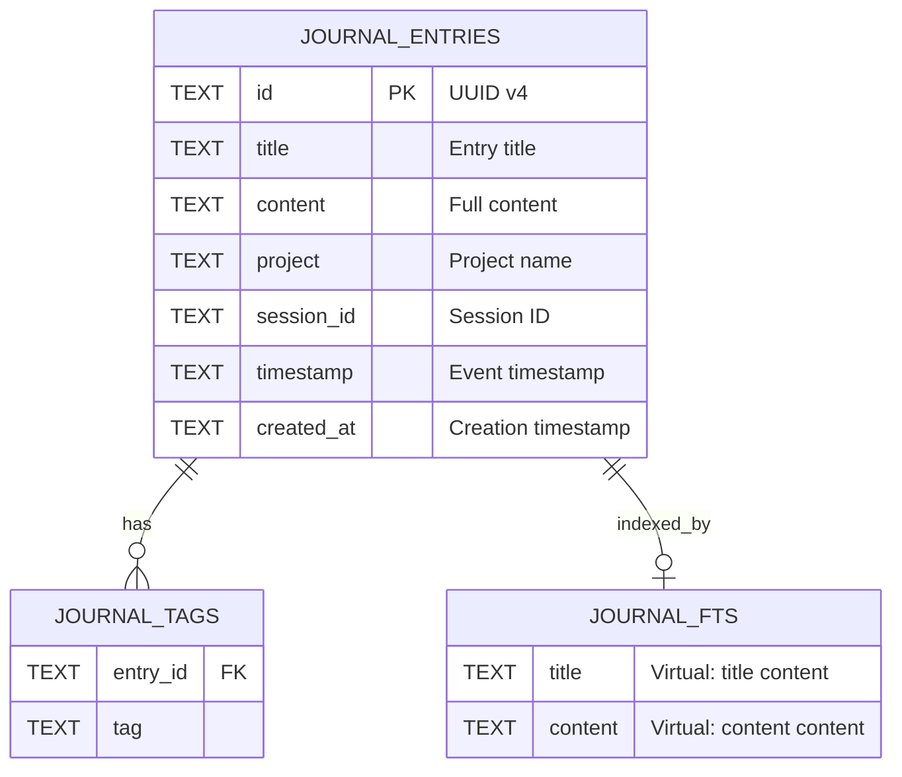

# SQLite FTS5

**Type:** technology

### From: journal

FTS5 (Full-Text Search version 5) is an advanced SQLite extension that powers the content indexing and search capabilities of the Ragent journal system, enabling efficient full-text queries across entry titles and content bodies. As a virtual table module, FTS5 operates separately from standard SQLite tables while maintaining transactional integrity, creating inverted indices that map terms to their containing documents for sub-linear query performance even with large journal corpora. The specific implementation in `journal.rs` declares a virtual table named `journal_fts` with columns for `title` and `content`, using the `content=journal_entries` directive to establish an external content table relationship that keeps the full-text index synchronized with the primary entries table without data duplication.

The architectural integration of FTS5 reflects sophisticated database design for knowledge management applications, where agents require rapid retrieval of relevant historical observations based on semantic content rather than exact matches. Unlike simple `LIKE` queries that scan entire tables linearly, FTS5 queries leverage tokenized, stemmed, and ranked result sets, supporting complex boolean expressions, phrase matching, and relevance scoring that would be computationally prohibitive with conventional indexing. The external content table pattern chosen here—where `journal_fts` references `journal_entries` rather than storing copies—optimizes storage efficiency while requiring careful transaction management to maintain consistency between the content source and its derived index.

The FTS5 virtual table operates in concert with the relational tag system, providing complementary query capabilities: FTS5 excels at unstructured content search while the `journal_tags` table enables precise categorical filtering. This dual-indexing strategy allows agents to execute sophisticated queries combining full-text relevance with structured metadata constraints, such as finding all entries containing "error handling" patterns that are tagged with "rust" and belong to a specific project session. The SQLite FTS5 extension represents a mature, battle-tested solution that avoids external search engine dependencies, simplifying deployment and operational complexity while providing professional-grade search functionality suitable for agent memory systems operating at scale.

## Diagram

## External Resources

- [Official SQLite FTS5 documentation](https://www.sqlite.org/fts5.html) - Official SQLite FTS5 documentation
- [SQLite external content tables documentation](https://www.sqlite.org/fts3.html#_external_content_tables_) - SQLite external content tables documentation
- [FTS5 full-text query syntax reference](https://sqlite.org/fts5.html#full_text_query_syntax) - FTS5 full-text query syntax reference

## Sources

- [journal](../sources/journal.md)
