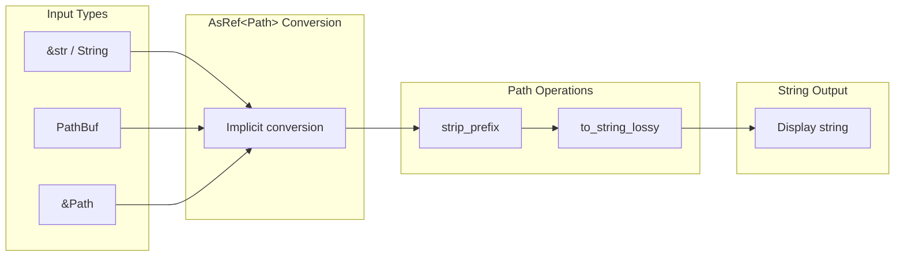

# std::path::Path

**Type:** technology

### From: format

The Rust standard library's `Path` type provides a cross-platform abstraction for file system paths, handling the complexities of Windows backslash separators versus Unix forward slashes, path normalization, and component extraction. In the `format.rs` module, `Path` serves as the underlying type for the `format_display_path` function, which creates user-friendly relative path representations.

The `Path` type is designed as an unsized type (similar to `str`), meaning it's typically used through references like `&Path` or owned variants like `PathBuf`. The ragent-core module leverages this by accepting `impl AsRef<Path>` parameters, allowing flexible input from strings, `PathBuf`, or raw `Path` references. This design pattern demonstrates idiomatic Rust path handling where generic abstractions enable API flexibility without sacrificing type safety.

The `format_display_path` function specifically uses `Path::strip_prefix` to attempt relativization and `to_string_lossy` for platform-compatible string conversion. These methods handle edge cases like non-UTF8 paths on Unix systems by replacing invalid sequences with the Unicode replacement character. This careful handling reflects production-quality path manipulation where user-facing output must remain valid Unicode even when underlying file systems contain unusual names.

## Diagram

## External Resources

- [Rust standard library Path documentation](https://doc.rust-lang.org/std/path/struct.Path.html) - Rust standard library Path documentation
- [Owned path variant PathBuf documentation](https://doc.rust-lang.org/std/path/struct.PathBuf.html) - Owned path variant PathBuf documentation

## Sources

- [format](../sources/format.md)
