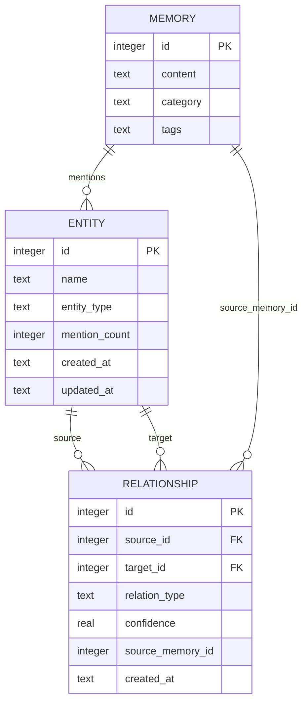

# Storage

**Type:** technology

### From: knowledge_graph

The Storage type represents the persistence layer abstraction that enables the knowledge graph system to operate against SQLite backends, though the actual implementation resides in the crate::storage module. This abstraction demonstrates clean architectural boundaries by defining a trait-based interface that the knowledge graph module consumes without direct dependency on database specifics. The storage interface exposes three critical operations for knowledge graph functionality: upsert_entity for idempotent entity creation with mention counting, create_relationship for edge insertion with provenance tracking, and list_entities/list_relationships for full graph retrieval.

The upsert_entity operation implements important deduplication semantics—when the same entity is encountered in multiple memories, the existing record is updated rather than duplicated, with mention_count incremented to track frequency. This design supports entity importance ranking and temporal analysis of concept emergence. The create_relationship operation includes a confidence parameter and optional source_memory_id, enabling attribution of relationship origins and quality assessment. These features position the storage layer to support sophisticated graph analytics including edge weight computation, provenance tracing, and confidence-based filtering.

## Diagram

## External Resources

- [SQLite database engine](https://www.sqlite.org/) - SQLite database engine
- [Upsert database operation pattern](https://en.wikipedia.org/wiki/Upsert) - Upsert database operation pattern

## Sources

- [knowledge_graph](../sources/knowledge-graph.md)
