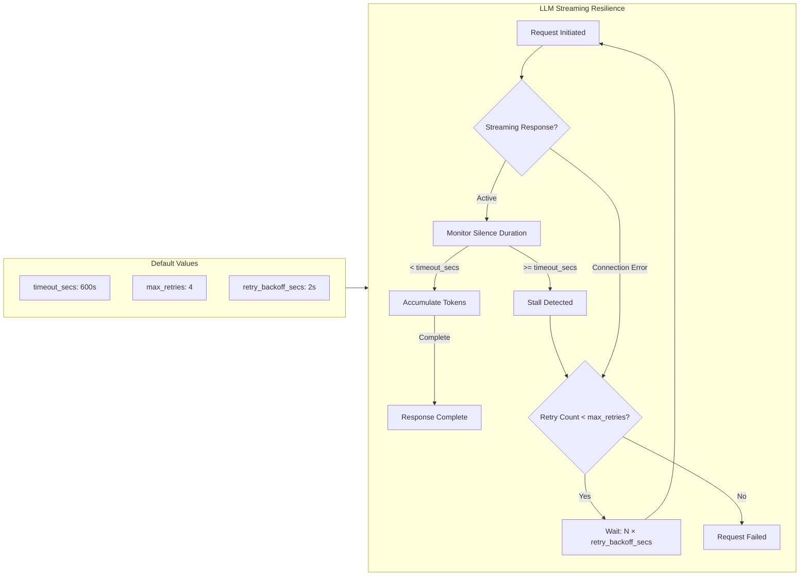

# StreamConfig

**Type:** technology

### From: mod

The `StreamConfig` struct addresses critical operational concerns when integrating with LLM APIs, particularly the handling of long-running streaming responses that characterize modern conversational AI. Streaming responses, while providing superior user experience through token-by-token delivery, introduce unique failure modes: network interruptions, provider rate limiting, and ambiguous timeout conditions where healthy streams may simply be delivering content slowly. This configuration encapsulates the defensive programming patterns necessary for production reliability.

Timeout configuration defaults to 600 seconds (10 minutes), reflecting empirical observations that complex reasoning chains or code generation tasks may legitimately consume extended duration. The retry mechanism implements exponential backoff through a linear multiplier rather than exponential growth, with `retry_backoff_secs` controlling the base delay that multiplies by attempt count. This produces delays of 2, 4, 6, 8 seconds for successive retries—aggressive enough to recover quickly from transient failures while respecting provider rate limits. The default 4 maximum retries provides substantial resilience without risking excessive API costs.

The implementation demonstrates Rust's const fn capabilities for compile-time default generation, ensuring zero-cost abstractions. The serde integration enables straightforward JSON override patterns, with the example configuration showing how users might tighten timeouts for faster failure detection in latency-sensitive environments or extend retries for unreliable network conditions. This struct exemplifies how ragent operationalizes the CAP theorem in practice: choosing availability (through retries) and partition tolerance, with consistency managed through idempotent request patterns at the provider level.

## Diagram

## External Resources

- [Reqwest HTTP client likely used for streaming implementation](https://docs.rs/reqwest/latest/reqwest/) - Reqwest HTTP client likely used for streaming implementation
- [OpenAI streaming API documentation with timeout considerations](https://platform.openai.com/docs/api-reference/chat/streaming) - OpenAI streaming API documentation with timeout considerations
- [Exponential backoff algorithm for retry mechanisms](https://en.wikipedia.org/wiki/Exponential_backoff) - Exponential backoff algorithm for retry mechanisms

## Sources

- [mod](../sources/mod.md)
