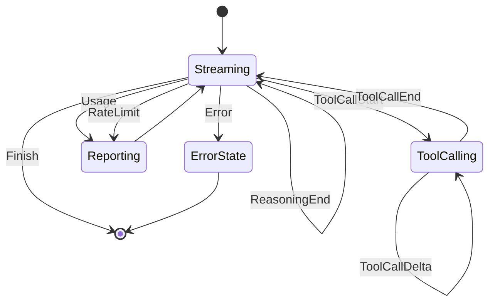

# StreamEvent

**Type:** technology

### From: mod

The `StreamEvent` enum represents the complete vocabulary of events that can flow from an LLM streaming response, designed to normalize disparate provider formats into a unified Rust type. This enum plays a critical role in the architecture by enabling incremental processing of model outputs—applications receive events as they arrive rather than blocking for complete responses. The eleven variants cover all essential aspects of modern LLM interactions: content generation through `TextDelta` and `ReasoningDelta`/`ReasoningStart`/`ReasoningEnd` (supporting chain-of-thought models like Claude 3.5 Sonnet), tool invocation via `ToolCallStart`, `ToolCallDelta`, and `ToolCallEnd`, operational metadata including `Usage` for token counting and `RateLimit` for quota management, and lifecycle events through `Error` and `Finish`.

The design carefully balances comprehensiveness with simplicity. Each variant carries precisely the data needed for its semantics: `TextDelta` and `ReasoningDelta` contain simple `text: String` fields for UTF-8 content fragments; tool-related events include `id: String` for correlating multi-part invocations; `ToolCallDelta` specifically carries `args_json: String` to accumulate partial JSON tool arguments. The `RateLimit` variant demonstrates sophisticated operational awareness with optional percentage fields for both request and token quotas, parsed from provider response headers. The `Finish` variant carries a `FinishReason` from the crate's event module, standardizing stop conditions across providers.

Deriving `Serialize` and `Deserialize` enables event persistence, logging, and network transmission, while `Clone` supports multiple consumers of the same stream. The enum's structure anticipates evolving LLM capabilities—reasoning blocks support emerging models with explicit thinking modes, image content in sibling types (`ContentPart::ImageUrl`) enables multimodal workflows, and the `options: HashMap<String, Value>` in `ChatRequest` allows provider-specific extensions without breaking changes.

## Diagram

## External Resources

- [OpenAI streaming API documentation](https://platform.openai.com/docs/api-reference/chat/streaming) - OpenAI streaming API documentation
- [Anthropic Messages API streaming documentation](https://docs.anthropic.com/en/api/messages-streaming) - Anthropic Messages API streaming documentation
- [Serde enum serialization strategies](https://serde.rs/enum-representations.html) - Serde enum serialization strategies

## Sources

- [mod](../sources/mod.md)
