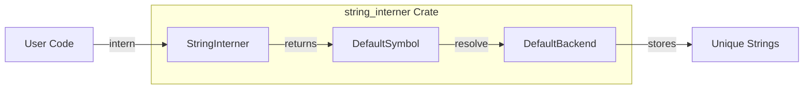

# string_interner

**Type:** technology

### From: intern

The `string_interner` crate is a popular Rust library that provides efficient string interning capabilities. It serves as the foundational dependency for this module, offering the `StringInterner` struct with a configurable backend system. The crate allows developers to store strings uniquely in memory and retrieve small integer-based symbol handles, dramatically reducing memory consumption when the same string values appear repeatedly throughout an application.

This crate supports multiple backend implementations through its generic design, with `DefaultBackend` being the standard choice for most use cases. The backend system enables different tradeoffs between memory usage and lookup performance. The `string_interner` crate is widely used in compiler implementations, interpreters, and any system that needs to process large volumes of text with many repeated values, making it particularly well-suited for agent systems that handle numerous tool names and identifiers.

## Diagram

## External Resources

- [Official documentation for the string_interner crate](https://docs.rs/string_interner/) - Official documentation for the string_interner crate
- [Crate registry page with usage statistics and dependencies](https://crates.io/crates/string_interner) - Crate registry page with usage statistics and dependencies

## Sources

- [intern](../sources/intern.md)
