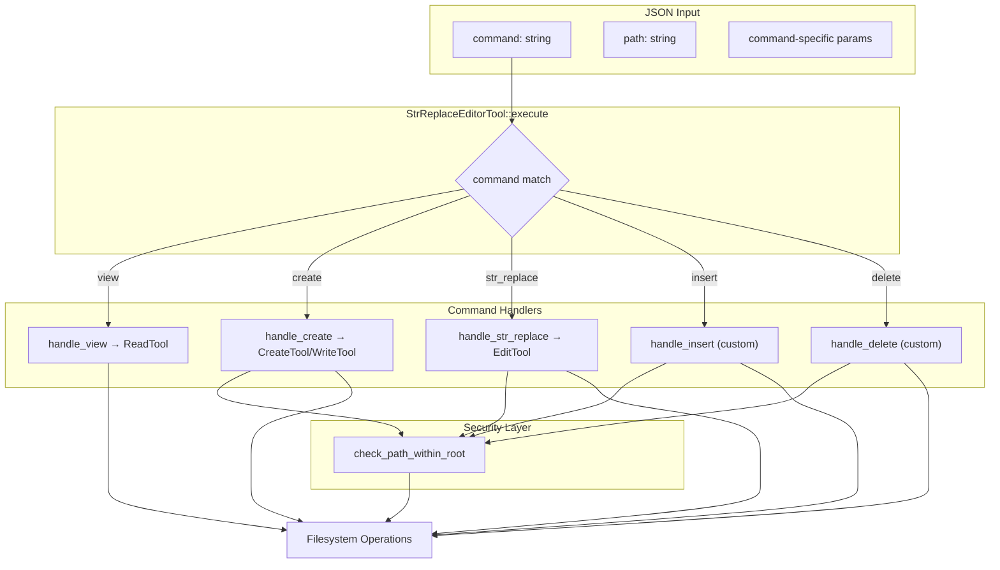

# StrReplaceEditorTool

**Type:** technology

### From: str_replace_editor

StrReplaceEditorTool is a Rust struct that implements a Claude-compatible multi-command file editor, serving as a critical bridge between AI models and filesystem operations. This tool was designed specifically to match Anthropic's `str_replace_based_edit_tool` interface, ensuring that language models trained on Claude's tool set can emit calls without encountering "Unknown tool" errors. The struct itself is a zero-sized type (unit struct) that implements the `Tool` trait, making it a lightweight handle that delegates actual work to specialized sub-tools or custom async handlers.

The tool's significance extends beyond simple file manipulation; it represents a carefully engineered solution to the AI alignment problem in developer tools. By providing exact compatibility with Claude's expected interface, it enables seamless migration or interoperability between different AI systems. The implementation demonstrates sophisticated understanding of how AI models actually behave in practice—notice the explicit warning in the description that "The 'str_replace' command REQUIRES both 'old_str' and 'new_str' parameters" and the emphatic "Do NOT call str_replace without providing old_str". These warnings exist because the developers observed models frequently omitting required parameters.

The architecture of StrReplaceEditorTool reveals a layered design pattern where the main struct defines the interface contract while five distinct command handlers (`handle_view`, `handle_create`, `handle_str_replace`, `handle_insert`, `handle_delete`) implement the specific behaviors. Three handlers delegate to existing tools in the module (`ReadTool`, `CreateTool`/`WriteTool`, `EditTool`), while two implement custom line-based manipulation logic. This design allows code reuse where appropriate while enabling precise control over complex operations like line insertion and deletion that require careful handling of newline characters and boundary conditions.

## Diagram

## External Resources

- [Anthropic's official documentation on tool use and the Claude tool system](https://docs.anthropic.com/en/docs/build-with-claude/tool-use) - Anthropic's official documentation on tool use and the Claude tool system
- [Serde serialization framework used for JSON parameter handling](https://serde.rs/) - Serde serialization framework used for JSON parameter handling
- [Tokio async runtime used for filesystem operations](https://tokio.rs/) - Tokio async runtime used for filesystem operations

## Sources

- [str_replace_editor](../sources/str-replace-editor.md)
