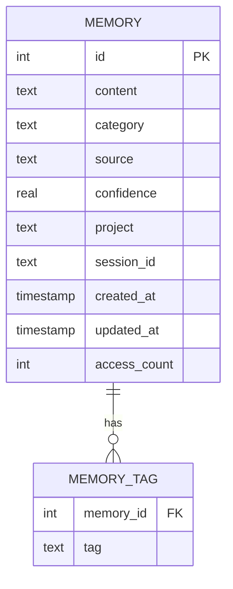

# StructuredMemory

**Type:** technology

### From: structured_memory

StructuredMemory represents the foundational data model and storage abstraction underlying the memory tool implementations, though it is referenced rather than defined within this source file. This entity encompasses both the in-memory representation of a memory record and the validation logic that ensures data integrity across the storage system. The model establishes a normalized schema for persisting discrete knowledge elements with associated metadata that enables efficient retrieval, filtering, and lifecycle management. Memory records contain core content alongside categorical classification, confidence scoring, source attribution, temporal tracking, and project scoping information.

The validation methods exposed by StructuredMemory—validate_category and validate_confidence—serve as gatekeepers for data quality, ensuring that only well-formed records enter the persistent store. Category validation enforces membership in a predefined taxonomy (MEMORY_CATEGORIES) that includes fact, pattern, preference, insight, error, and workflow types. This controlled vocabulary prevents schema drift and ensures that retrieval filters can operate against known values. Confidence validation enforces numeric bounds on the 0.0 to 1.0 range, rejecting scores outside this interval that would compromise filtering and ranking operations. These validation routines are invoked by MemoryStoreTool during creation and by MemoryForgetTool when filter criteria include category constraints.

The StructuredMemory abstraction likely also encompasses the storage interface methods referenced throughout the tool implementations: create_memory for persistence, search_memories for FTS5-based retrieval with filtering, get_memory_tags for associated tag retrieval, delete_memory for single-record removal, and delete_memories_by_filter for batch operations. This separation of concerns isolates database-specific implementation details from the tool logic, enabling potential storage backend substitutions and facilitating testing through mock implementations. The integration with SQLite FTS5 for full-text search represents a key capability that distinguishes this structured approach from simpler key-value or document storage alternatives.

## Diagram

## External Resources

- [SQLite data types documentation](https://www.sqlite.org/datatype3.html) - SQLite data types documentation
- [Database normalization concepts on Wikipedia](https://en.wikipedia.org/wiki/Database_normalization) - Database normalization concepts on Wikipedia

## Sources

- [structured_memory](../sources/structured-memory.md)
