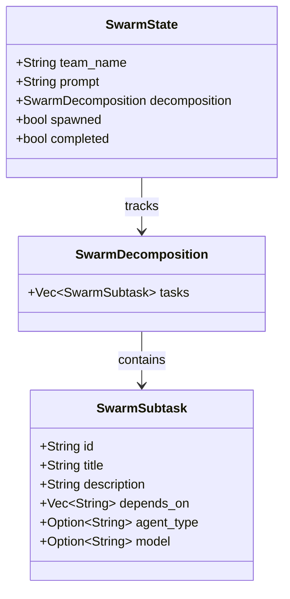

# SwarmSubtask

**Type:** technology

### From: swarm

SwarmSubtask is the fundamental work unit in the ragent swarm decomposition system, representing a single parallelizable task that can be assigned to an independent AI coding agent. The struct encapsulates all metadata necessary for task execution including a unique identifier (typically formatted as "s1", "s2", etc.), a human-readable title for quick reference, and a detailed description containing implementation instructions comprehensive enough that an agent can execute without additional clarification.

The dependency management system is implemented through the `depends_on` field, which contains a vector of task IDs that must complete before this subtask can begin execution. This directed acyclic graph structure enables the orchestrator to schedule tasks optimally while respecting necessary sequencing constraints. The design explicitly minimizes dependencies to maximize parallelism, following the architectural principle that agents operate in isolated context windows without visibility into each other's work.

Optional configuration fields provide flexibility for specialized execution scenarios. The `agent_type` field allows overriding the default "general" agent type for tasks requiring specific capabilities, while the `model` field supports provider/model specification in "provider/model" format for cases where particular models excel at specific subtask types. This per-task model selection enables heterogeneous agent teams where different subtasks leverage different underlying LLM capabilities optimized for their specific requirements.

## Diagram

## External Resources

- [Serde serialization framework documentation for Rust](https://serde.rs/) - Serde serialization framework documentation for Rust
- [Directed acyclic graph - Wikipedia explanation of dependency graph structures](https://en.wikipedia.org/wiki/Directed_acyclic_graph) - Directed acyclic graph - Wikipedia explanation of dependency graph structures

## Sources

- [swarm](../sources/swarm.md)
