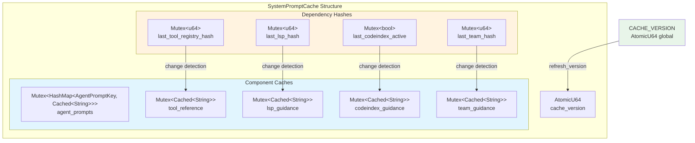

# SystemPromptCache

**Type:** technology

### From: cache

The SystemPromptCache is the central caching mechanism for system prompt components in the ragent-core session management system. This sophisticated cache structure recognizes that system prompts in LLM applications are typically composed of multiple independent components: agent base prompts, tool reference sections, LSP (Language Server Protocol) guidance, code index guidance, and team guidance. Rather than treating the system prompt as a monolithic block that must be regenerated entirely when any input changes, SystemPromptCache maintains separate cache entries for each component with dependency-specific invalidation triggers.

The cache uses a combination of global versioning and component-specific hashing to determine cache validity. Each component has its own `Cached<String>` entry protected by a Mutex, along with corresponding hash trackers that detect when underlying dependencies have changed. For example, the tool reference cache monitors the `ToolRegistry` hash, while the LSP guidance cache tracks LSP server state changes. This granular approach significantly reduces computational overhead in production environments where certain components change frequently (like agent prompts) while others remain relatively stable (like tool definitions).

The implementation handles concurrent access through careful use of `std::sync::Mutex` for each component cache and `AtomicU64` for the cache version counter. Methods like `get_agent_prompt`, `get_tool_reference`, and `get_lsp_guidance` follow a consistent pattern: refresh the version, check dependency hashes, return cached values if valid, or compute and cache new values if invalid. The cache also provides targeted invalidation methods such as `invalidate_tool_cache()` and `invalidate_team_cache()` that allow external systems to signal changes without triggering full cache rebuilds. This design pattern is essential for maintaining responsive agent systems where system prompt construction could otherwise become a bottleneck.

## Diagram

## External Resources

- [Rust AtomicU64 documentation for lock-free concurrent programming](https://doc.rust-lang.org/std/sync/atomic/struct.AtomicU64.html) - Rust AtomicU64 documentation for lock-free concurrent programming
- [Tokio async mutex patterns (comparison to std::sync::Mutex)](https://docs.rs/tokio/latest/tokio/sync/struct.Mutex.html) - Tokio async mutex patterns (comparison to std::sync::Mutex)
- [Language Server Protocol specification for LSP integration](https://microsoft.github.io/language-server-protocol/) - Language Server Protocol specification for LSP integration

## Sources

- [cache](../sources/cache.md)
