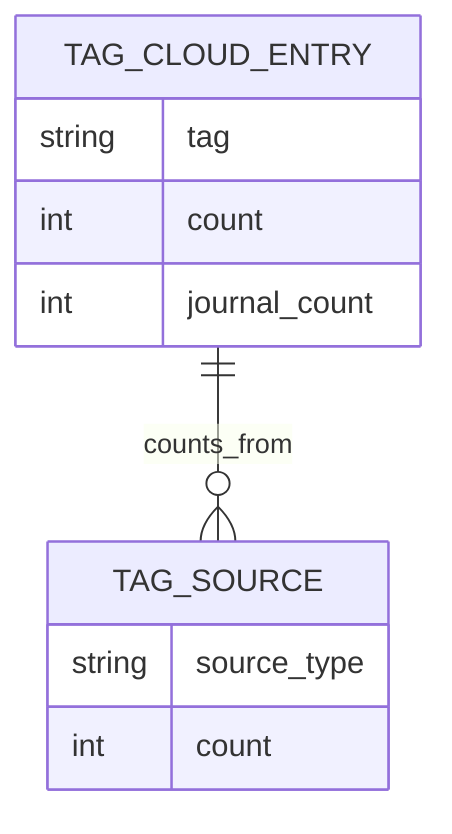

# TagCloudEntry

**Type:** technology

### From: visualisation

TagCloudEntry structures frequency data for individual tags within a tag cloud visualisation, supporting a dual-source counting mechanism that distinguishes between memory occurrences and journal entry occurrences. The core count field tracks tag frequency across structured memories, while the optional journal_count field captures separate tallies from journal entries when present. This bifurcated design recognizes that the ragent system maintains two distinct content types—memories (structured, categorized knowledge) and journal entries (chronological narrative records)—that may share tags but warrant separate accounting for visualisation purposes. The Option wrapper on journal_count enables space-efficient serialization omitting the field entirely when a tag appears exclusively in memories.

The struct participates in a merge algorithm within generate_tag_cloud that unifies tags from both source types using a HashSet for deduplication, then constructs TagCloudEntry instances with appropriate count retrieval for each source. This approach handles the asymmetric case where tags may exist in only one content type, defaulting absent counts to zero via unwrap_or. The sorting logic in generate_tag_cloud uses count (memory occurrences) as the primary sort key in descending order, establishing a hierarchy where memory frequency takes precedence over journal frequency. This prioritization suggests the tag cloud serves primarily as a memory navigation aid with journal data providing supplementary context.

The test_tag_cloud_sorting verification case demonstrates this ranking behavior with a three-element vector: rust (10 memories, 5 journals), debugging (7 memories, 2 journals), and python (3 memories, no journals). Post-sort, rust correctly occupies the first position despite debugging having higher total cross-type frequency, confirming memory-count primacy. This behavior enables predictable visualisation where tag sizing (typically proportional to frequency in cloud layouts) reflects the primary organizational structure of the memory system. The struct's fields align with common tag cloud rendering requirements where visual weight encoding (font size, color intensity) typically maps to a single numeric dimension, with journal_count available for tooltip elaboration or multi-series visualisation.

## Diagram

## External Resources

- [Tag cloud visualisation technique and design patterns](https://en.wikipedia.org/wiki/Tag_cloud) - Tag cloud visualisation technique and design patterns

## Sources

- [visualisation](../sources/visualisation.md)
