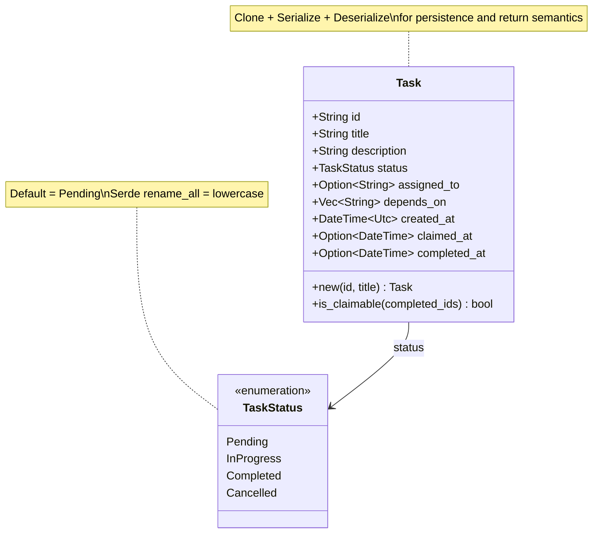

# Task

**Type:** technology

### From: task

The Task struct represents the fundamental unit of work in the ragent collaborative system, encapsulating all metadata necessary to track a work item from creation through completion. As a plain data struct with Serde derive macros for serialization, Task serves dual purposes: runtime representation in memory and persistent JSON format on disk. The design carefully balances simplicity with expressiveness, providing fields for identification, description, state tracking, assignment, dependency management, and temporal auditing.

Each task carries a unique string identifier that serves as its primary key, alongside human-readable title and description fields that enable both automated processing and manual inspection. The status field uses the TaskStatus enum to track lifecycle progression, while `assigned_to` optionally references the claiming agent. The `depends_on` vector is particularly significant—it enables workflow modeling where tasks have prerequisites, with the `is_claimable()` method implementing the logic that checks whether all dependencies are satisfied by examining completed task IDs. Temporal fields (`created_at`, `claimed_at`, `completed_at`) provide audit trails and enable analytics on workflow efficiency.

The Task implementation demonstrates Rust's type system strengths for domain modeling. The `new()` constructor uses `impl Into<String>` for ergonomic API usage, accepting any string-like type. The `is_claimable()` method encapsulates business logic directly on the type, checking both that status is Pending and that the dependency closure is satisfied. This design prevents invalid state transitions at the type level—there's no direct way to mutate status without going through the TaskStore's controlled methods. The struct's Clone derive enables the pattern seen throughout TaskStore where tasks are cloned before returning, ensuring that returned data doesn't retain references to the internal mutable state locked within the store's critical sections.

## Diagram

## External Resources

- [Rust Into trait for ergonomic type conversions in constructors](https://doc.rust-lang.org/std/convert/trait.Into.html) - Rust Into trait for ergonomic type conversions in constructors
- [Serde derive macros for automatic serialization/deserialization](https://serde.rs/derive.html) - Serde derive macros for automatic serialization/deserialization
- [Chrono date/time library used for task timestamps](https://docs.rs/chrono/latest/chrono/) - Chrono date/time library used for task timestamps

## Sources

- [task](../sources/task.md)
