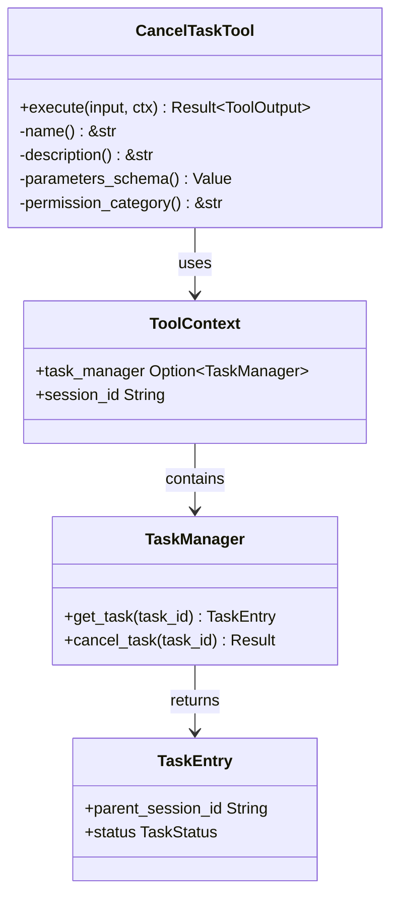

# TaskManager

**Type:** technology

### From: cancel_task

The `TaskManager` represents a core abstraction within the ragent-core architecture responsible for orchestrating the lifecycle of concurrent sub-agent executions. While not fully defined in this source file, its interface reveals critical responsibilities including task registration, retrieval, and cancellation operations. The manager maintains task metadata that includes parent session identifiers, enabling the hierarchical relationship tracking necessary for security isolation between different agent sessions. In production implementations, such task managers typically coordinate with underlying async runtime schedulers, handle task state transitions through defined lifecycle phases (pending, running, completed, cancelled), and manage resource cleanup to prevent memory leaks from orphaned task handles. The `TaskManager` abstraction allows the `CancelTaskTool` to remain agnostic of specific concurrency primitives, whether based on tokio tasks, async-std, or custom thread pools, promoting testability and portability across different deployment environments.

## Diagram

## External Resources

- [Tokio async runtime commonly used for task management in Rust](https://tokio.rs/) - Tokio async runtime commonly used for task management in Rust
- [async-trait crate enabling async methods in traits](https://docs.rs/async-trait/latest/async_trait/) - async-trait crate enabling async methods in traits

## Sources

- [cancel_task](../sources/cancel-task.md)

### From: list_tasks

TaskManager is a central architectural abstraction in the ragent-core system responsible for coordinating and persisting the lifecycle state of sub-agent tasks across asynchronous execution contexts. As referenced in the ListTasksTool implementation, this component provides the core storage and retrieval mechanisms that enable task introspection, with methods including get_task for individual task retrieval and list_tasks for session-scoped enumeration. The TaskManager's design as an optional field in ToolContext suggests a modular architecture where task management capabilities can be conditionally present depending on runtime configuration, with explicit error handling when uninitialized. The component manages complex state including task status transitions, temporal metadata, hierarchical session relationships, and result accumulation.

The TaskManager abstraction embodies sophisticated distributed systems concerns including consistency guarantees for task state updates, session isolation for multi-tenant deployments, and efficient querying capabilities for operational monitoring. The implementation reveals support for four distinct task statuses (Running, Completed, Failed, Cancelled) that form a state machine for task lifecycle management, with explicit enumeration in the crate::task::TaskStatus type. The component maintains bidirectional session relationships through parent_session_id and child_session_id tracking, enabling reconstruction of agent delegation hierarchies and supporting recursive debugging of complex multi-agent workflows. The inclusion of background task support indicates architectural accommodation for fire-and-forget agent operations that proceed independently of spawning agent execution.

TaskManager's integration points with the broader system demonstrate careful separation of concerns, with task execution decoupled from task state management to enable reliable observation of potentially long-running or failed operations. The component's async interface methods (get_task and list_tasks returning impl Future) reflect non-blocking design principles appropriate for I/O-bound state persistence, potentially backed by durable storage for fault tolerance. The metadata tracked by TaskManager—including creation timestamps, completion timestamps, agent identifiers, task prompts, results, and errors—provides comprehensive provenance information for audit trails and debugging. This design supports advanced operational patterns such as task replay, failure analysis, and performance optimization through historical execution analysis.

### From: new_task

The `TaskManager` is a critical dependency referenced throughout the `NewTaskTool` implementation, though not defined in this file. It serves as the core orchestration component for sub-agent lifecycle management within the broader agent framework. The `TaskManager` is accessed through `ToolContext.task_manager` as an `Option<Arc<dyn TaskManager>>`, requiring explicit initialization check before any spawning operations can proceed.

The implementation reveals two primary spawning interfaces exposed by `TaskManager`: `spawn_background` for asynchronous, non-blocking task execution, and `spawn_sync` for synchronous, blocking execution. Both methods accept similar parameters including parent session ID, agent name, task instructions, optional model override, and working directory. The `spawn_background` method returns a task entry containing an ID and agent name, enabling later correlation through `Event::SubagentComplete` notifications. The `spawn_sync` method returns a richer result structure containing both the entry and the complete response content from the sub-agent execution.

The architectural relationship between `NewTaskTool` and `TaskManager` exemplifies dependency injection and context-based resource provision. Rather than holding direct references, the tool receives its dependencies through the `ToolContext` parameter, enabling flexible testing configurations and runtime dependency management. The error message "TaskManager has not been initialised" suggests `TaskManager` may be feature-gated or require explicit setup, indicating sophisticated initialization requirements in production deployments. The task manager's abstraction as a trait object (`dyn TaskManager`) enables polymorphic implementations supporting different execution backends.

### From: wait_tasks

TaskManager is a core subsystem referenced by WaitTasksTool that maintains the lifecycle and state of all tasks within a session. The tool interacts with TaskManager through three primary interfaces: `list_tasks` for retrieving current task states, `increment_waiter` for registering interest in task completion events, and `decrement_waiter` for cleanup. These methods suggest TaskManager implements reference counting to optimize event delivery—tasks with active waiters receive immediate notifications, while un-watched tasks may be processed through different paths.

The TaskManager's `list_tasks` method returns a comprehensive snapshot including task status (Running, Completed, Failed), background flag, result/error strings, agent names, and timing metadata (created_at, completed_at). This rich data model enables WaitTasksTool to compute elapsed times in milliseconds and count output lines for the structured metadata returned to callers. The session-scoped query (`&ctx.session_id`) indicates TaskManager supports multi-session isolation, a critical requirement for agent systems serving multiple concurrent user sessions.

The wait counting mechanism reveals sophisticated optimization in the task notification system. By tracking waiter counts, TaskManager can implement "drain_completed" functionality that only notifies interested parties, avoiding broadcast storms in systems with many completed tasks. The requirement that TaskManager be initialized (`as_ref().ok_or_else(...)`) suggests it's an optional component, allowing the tool system to function in degraded modes or testing contexts without full task infrastructure. This design supports graceful degradation and flexible deployment scenarios.
