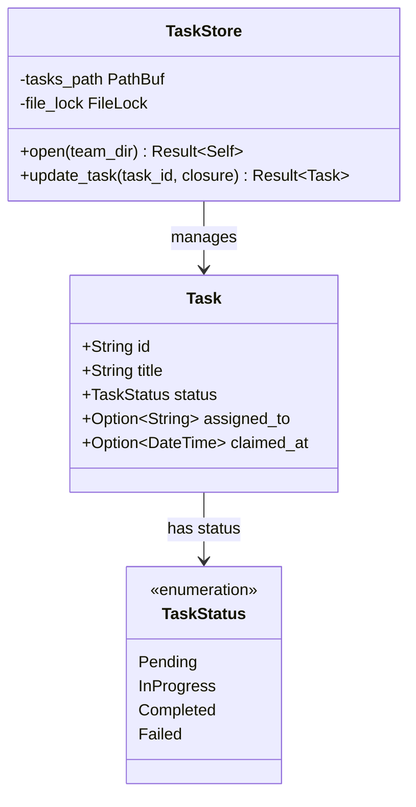

# TaskStore

**Type:** technology

### From: team_assign_task

The `TaskStore` is a critical persistence abstraction within the ragent team subsystem, responsible for durable storage and atomic manipulation of task entities. Based on its usage pattern in `TeamAssignTaskTool`, `TaskStore` implements a file-system backed repository pattern that enables concurrent-safe access to task state through an `open` method establishing store connections and an `update_task` method providing atomic update semantics. This design prevents race conditions during multi-agent task claim and assignment operations where multiple agents might attempt to modify task state simultaneously.

The store's API design emphasizes transactional integrity through its closure-based update pattern. Rather than exposing raw mutable references that could lead to inconsistent states, `update_task` accepts a closure that receives a mutable task reference, applies transformations, and returns the modified task. This pattern enables the store implementation to handle locking, serialization, and error recovery transparently. The `TaskStore` integrates with `chrono` for timestamp management, as evidenced by the `claimed_at` field being populated with `chrono::Utc::now()` during assignment operations.

`TaskStore` collaborates closely with `TeamStore` in the task assignment workflow. While `TeamStore` manages the static configuration of team membership and agent identities, `TaskStore` manages the dynamic runtime state of tasks including status transitions, assignment tracking, and temporal metadata. This separation of concerns enables independent scaling and evolution of configuration versus operational data, with both stores co-located in the team's directory structure for organizational coherence.

## Diagram

## External Resources

- [Asynchronous Programming in Rust - patterns for store implementations](https://rust-lang.github.io/async-book/) - Asynchronous Programming in Rust - patterns for store implementations
- [Rust File System Module - underlying primitives for store persistence](https://doc.rust-lang.org/std/fs/) - Rust File System Module - underlying primitives for store persistence

## Sources

- [team_assign_task](../sources/team-assign-task.md)

### From: team_spawn

The `TaskStore` component provides specialized persistence for work items within the team framework, specifically utilized in `TeamSpawnTool` for optional task pre-assignment to newly spawned teammates. Imported from `crate::team::task`, this store manages the lifecycle of discrete work units that can be claimed, assigned, and completed by team members. The integration pattern—opening the store from a team directory, then calling `pre_assign_task`—suggests a hierarchical organization where tasks belong to specific teams while maintaining independent storage concerns.

The `pre_assign_task` operation is particularly significant for workflow orchestration: it allows the lead agent to reserve a specific task identifier for a teammate before that teammate begins execution, eliminating race conditions in task claiming and enabling deterministic workload distribution. This pattern supports sophisticated coordination scenarios including task splitting, parallel execution with defined work boundaries, and progress tracking across distributed agent workers. The operation's result handling—with explicit success logging and warning-level failure logging—provides observability into task assignment reliability without failing the spawn operation itself.

The conditional nature of task store interaction (nested `if let` chains requiring both `task_id` parameter and successful store operations) demonstrates defensive design where task management enhances but doesn't mandate team spawning. This optional coupling allows flexible deployment modes from simple collaborative sessions without formal task tracking to rigorous project management with full work item lifecycle control. The messaging integration—formatting task assignment status into the final `ToolOutput` content—ensures transparent communication of pre-assignment outcomes to both the orchestrating agent and potentially end users.

### From: team_status

TaskStore represents the complementary persistence subsystem to TeamStore, dedicated exclusively to task lifecycle management within agent teams. While TeamStore focuses on who (the agents) and how (team structure), TaskStore manages what (work items) and their progress states. The design philosophy evident in the TeamStatusTool implementation treats TaskStore as supplementary—teams can exist and report status independently of task tracking, but task information enriches status reports when available. This separation of concerns enables flexible deployment scenarios where teams may operate with varying degrees of work tracking formality.

The TaskStore API surface visible in this code follows a connection-oriented pattern: `TaskStore::open` acquires access to task persistence for a specific team directory, returning a handle that can perform operations like `read` to retrieve the complete task collection. The error handling strategy is particularly instructive—`TaskStore::open` and `read` failures cascade through `and_then` composition, with `unwrap_or_default` providing a graceful degradation path to empty task lists. This resilience pattern acknowledges that task stores may be temporarily unavailable, corrupted, or intentionally absent for teams not yet engaged in tracked work.

The task data model inferred from filtering operations includes a `tasks` vector where individual tasks carry a `status` field drawing from at least three enumerated values: Completed, InProgress, and Pending. These statuses enable the progress tracking visualization that TeamStatusTool produces, showing aggregate counts like "5/12 done | 3 in progress | 4 pending". The implicit task structure likely contains additional fields (descriptions, priorities, assignments, timestamps) not directly accessed by the status tool but available to other task-oriented tools in the framework.

### From: team_task_claim

TaskStore is the persistent storage abstraction underlying all task operations in this system, referenced throughout the TeamTaskClaimTool implementation though defined externally in the crate::team module. It provides atomic, file-backed operations for task state transitions, serving as the consistency backbone that enables safe concurrent access by multiple agents. The open method establishes a connection to a team's task directory, while read provides snapshot access to current task states and the claim methods implement compare-and-swap semantics for conflict-free work acquisition.

The store's design reflects careful attention to distributed systems concerns. File locking prevents the race conditions that would otherwise occur when multiple agents simultaneously attempt to claim the next available task. The claim_next operation implements priority-aware selection, returning the highest-priority pending task with satisfied dependencies. The claim_specific variant enables targeted acquisition with validation that the requesting agent hasn't already claimed a different task, enforcing the single-task-per-agent invariant that prevents work fragmentation.

TaskStore's error model distinguishes between retriable conditions (dependency unsatisfied, task already claimed) and fundamental failures (storage corruption, permission denied), though the tool layer adds additional context for agent-facing messages. The separation between storage and tool layers enables testing strategies where TaskStore can be mocked or replaced with alternative backends while preserving the claim tool's business logic. This abstraction also facilitates operational flexibility, allowing teams to choose between local filesystem storage, network filesystems, or eventually consistent replicated storage based on deployment constraints.

### From: team_task_complete

TaskStore represents the persistent storage abstraction for team task state in this multi-agent system. While the complete implementation is not visible in this source file, its interface reveals a filesystem-backed persistence layer designed for durability and concurrent access scenarios. The store operates on a directory-per-team model, with `TaskStore::open()` accepting a team directory path and returning a handle for subsequent operations. This design enables multiple agents to potentially coordinate through shared filesystem state, though the implementation details of concurrency control are abstracted.

The store exposes several critical operations used by `TeamTaskCompleteTool`: `read()` for retrieving the complete task list, `complete()` for atomically marking a task as done, and `update_task()` for modifying task properties. The `complete()` method implements ownership validation, ensuring that only the assigned agent can mark a task complete—a crucial security property in delegated agent workflows. This method returns the updated task on success, enabling the tool to access completion metadata like timestamps for downstream processing.

The `update_task` method accepts a closure for atomic updates, following Rust's patterns for safe mutation. This is used in the hook rejection scenario to revert task state, demonstrating transactional semantics where partial completions can be rolled back. The store's design likely incorporates serialization formats (probably JSON given the ecosystem) and file locking or atomic write patterns to prevent corruption during concurrent access. The choice of filesystem storage over database systems suggests deployment simplicity and human inspectability as design priorities.

The integration between `TaskStore` and the tool layer exemplifies clean architectural boundaries in Rust systems. The tool layer contains business logic and orchestration concerns, while `TaskStore` handles persistence mechanics. This separation enables testing through mock stores and potential future migration to other storage backends without tool reimplementation. The store's API design with explicit `Result` types propagates failures appropriately, allowing the tool to distinguish between "task not found," "permission denied," and "storage error" scenarios for appropriate user messaging.

### From: team_task_create

TaskStore represents a persistent storage abstraction for managing task instances within the team coordination system. Based on its usage patterns in the code, it provides CRUD operations for individual tasks with filesystem-backed durability, enabling task state to survive process restarts and facilitating inspection or manual intervention. The open method suggests connection establishment to a storage backend, while remove_task enables deletion operations necessary for the hook rejection rollback pattern.

The storage design appears to follow a directory-per-team model where task state is colocated with team configuration, suggesting a filesystem hierarchy that mirrors organizational structure. This approach offers several advantages for agent systems: human-readable state that can be version controlled, simple backup and migration procedures, and debuggability through direct filesystem inspection. The TaskStore interface abstracts underlying serialization concerns, likely handling JSON or similar structured format persistence transparently.

TaskStore's role in the ecosystem includes maintaining task lifecycle state transitions, supporting dependency tracking across tasks, and enabling concurrent access patterns appropriate for multi-agent environments. The separation between TeamStore (team-level operations) and TaskStore (task-level operations) indicates a deliberate architectural choice to partition concerns, potentially allowing different storage backends or consistency models for different data granularities. This layered storage architecture supports scalability considerations where team metadata and task instances might benefit from different caching, replication, or indexing strategies.

### From: team_task_list

TaskStore represents the persistence abstraction layer for team task data within the ragent-core system, providing structured access to task collections stored on the filesystem. This component implements the repository pattern, encapsulating the details of data serialization, file location resolution, and concurrent access management. The open method accepts a directory path and returns a ready-to-use store instance, while the read method retrieves the complete task list state, suggesting an optimistic concurrency model where writes are relatively infrequent and full-state reads are acceptable.

The design of TaskStore reflects pragmatic engineering choices for agent-oriented systems. Filesystem-based storage offers transparency, debuggability, and trivial backup capabilities compared to database alternatives—developers can inspect team state using standard shell tools and version control systems. The store's interface implies structured data formats (likely JSON or similar) with schema evolution considerations, as evidenced by the TaskList return type containing a tasks vector. This architecture supports multi-agent scenarios where independent processes may read and write task state, with filesystem atomicity primitives providing basic consistency guarantees.

TaskStore's integration with find_team_dir establishes a convention-based directory structure where team data is organized hierarchically under a working directory root. This location transparency enables flexible deployment configurations, from single-directory development setups to distributed network filesystems. The error propagation through anyhow::Result indicates comprehensive error handling that aggregates I/O failures, serialization errors, and schema mismatches into diagnostic-friendly error chains. As a foundational component, TaskStore likely supports multiple tools beyond TeamTaskListTool, including task creation, updates, and deletion operations, forming a complete CRUD interface for team task management.
