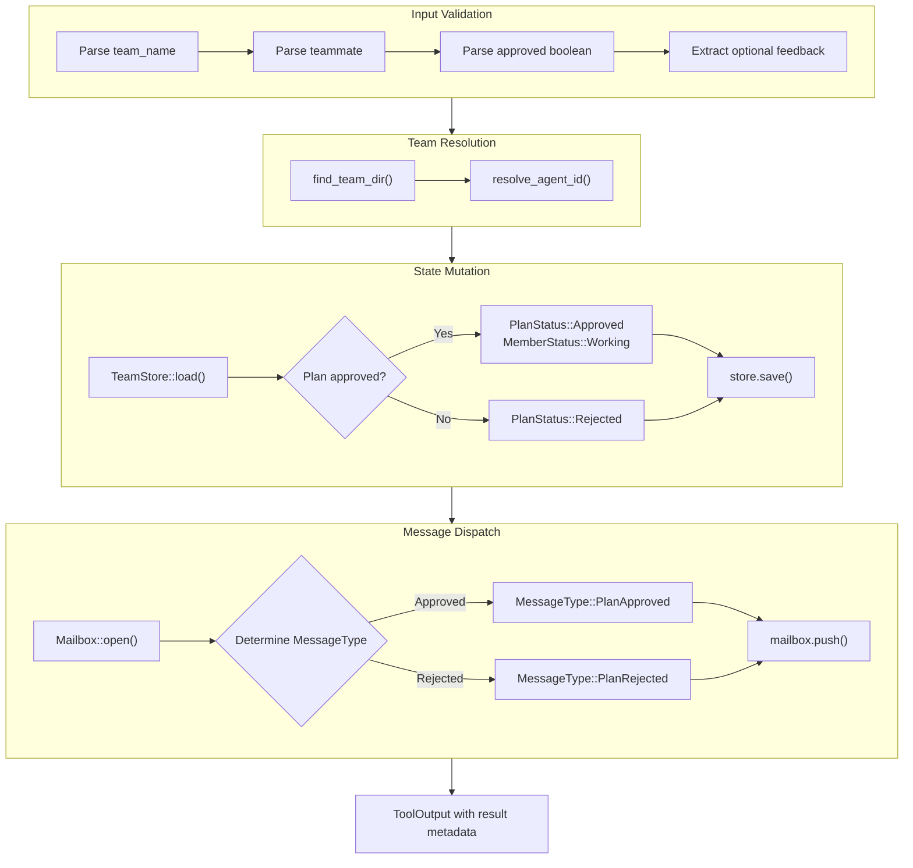

# TeamApprovePlanTool

**Type:** technology

### From: team_approve_plan

TeamApprovePlanTool is a concrete implementation of the Tool trait in a Rust-based multi-agent coordination framework. This struct serves as the primary mechanism through which team leads exercise oversight over teammate activities, specifically controlling the transition from planning to implementation phases. The tool encapsulates the business logic for plan approval workflows, managing state transitions, persistent storage updates, and inter-agent notifications. Unlike simpler tools that might only read data, this tool performs complex state mutations across multiple subsystems atomically within its execution scope.

The architectural significance of TeamApprovePlanTool lies in its role as a state transition controller within a finite state machine governing teammate lifecycle. The implementation reveals careful attention to error handling at each stage: parameter validation, team resolution, identity mapping, state mutation, and message dispatch. Each failure point returns descriptive errors using the anyhow crate's ergonomic error handling. The tool maintains consistency between in-memory state and persistent storage through the TeamStore abstraction, which provides transactional save capabilities. The asynchronous execution model allows this tool to operate within larger concurrent systems without blocking other operations.

The tool's design reflects real-world organizational patterns where gatekeeping functions require clear audit trails and feedback mechanisms. The optional feedback parameter demonstrates user-centered design, providing meaningful context for rejection decisions while maintaining simplicity for approval scenarios. The implementation also shows defensive programming through the resolve_agent_id call, which maps human-readable teammate names to canonical agent identifiers, preventing confusion in teams with naming collisions or aliases. This indirection layer enables flexible team composition while maintaining stable internal references.

## Diagram

## External Resources

- [async-trait crate documentation for async trait implementation in Rust](https://docs.rs/async-trait/latest/async_trait/) - async-trait crate documentation for async trait implementation in Rust
- [anyhow crate for flexible error handling in Rust applications](https://docs.rs/anyhow/latest/anyhow/) - anyhow crate for flexible error handling in Rust applications
- [Serde serialization framework documentation for JSON handling](https://serde.rs/) - Serde serialization framework documentation for JSON handling

## Sources

- [team_approve_plan](../sources/team-approve-plan.md)
