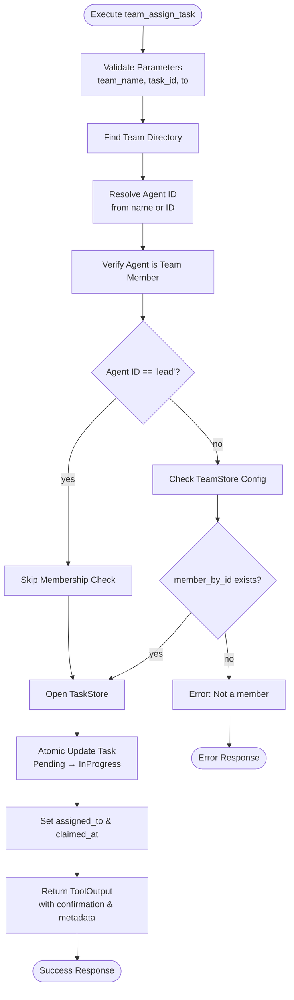

# TeamAssignTaskTool

**Type:** technology

### From: team_assign_task

The `TeamAssignTaskTool` is a concrete implementation of the `Tool` trait within the ragent-core framework, specifically designed to handle direct task assignment operations in multi-agent team environments. This struct serves as the bridge between high-level agent intents and low-level task state mutations, encapsulating all the logic required for a team lead to delegate work to team members. Unlike automated task distribution systems, this tool provides explicit, intentional assignment with full auditability through its persistent storage integration.

The tool's implementation follows a rigorous validation pipeline that ensures operational integrity before any state changes occur. First, it validates all three required parameters (`team_name`, `task_id`, and `to`) are present and properly formatted as strings. It then locates the team's directory structure, resolves the target identifier (which may be a human-readable name or canonical agent ID), and verifies the resolved agent actually belongs to the specified team configuration. This multi-layer validation prevents common failure modes such as assigning tasks to non-existent teams, tasks that don't exist, or agents outside the team's scope.

The actual task mutation occurs within a closure passed to `TaskStore::update_task`, which provides atomic update semantics—ensuring that concurrent modifications don't corrupt task state. The transformation changes the task status from `Pending` to `InProgress`, records the assignment in the `assigned_to` field, and timestamps the operation with `claimed_at`. The tool's response includes both human-readable confirmation and structured metadata, supporting both user-facing displays and programmatic consumption by orchestration layers.

## Diagram

## External Resources

- [serde_json - JSON serialization library used for parameter schemas and metadata](https://docs.rs/serde_json/latest/serde_json/) - serde_json - JSON serialization library used for parameter schemas and metadata
- [anyhow - Error handling library for ergonomic error propagation](https://docs.rs/anyhow/latest/anyhow/) - anyhow - Error handling library for ergonomic error propagation
- [async_trait - Proc macro for async methods in traits](https://docs.rs/async-trait/latest/async_trait/) - async_trait - Proc macro for async methods in traits

## Sources

- [team_assign_task](../sources/team-assign-task.md)
