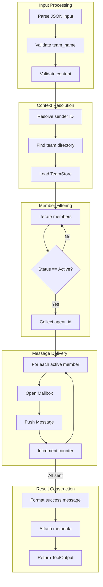

# TeamBroadcastTool

**Type:** technology

### From: team_broadcast

TeamBroadcastTool is a specialized communication component within the ragent-core framework that implements one-to-many message dissemination in multi-agent environments. The struct itself is a zero-sized type (unit struct) that serves as the concrete implementation of the abstract `Tool` trait, demonstrating the use of marker types in Rust for behavior-centric designs. This architectural choice emphasizes that the tool's functionality lies entirely in its trait implementation rather than in stored state, making instances extremely lightweight and suitable for high-frequency instantiation in agent workflows.

The tool's primary responsibility is orchestrating broadcast communication across team boundaries while respecting agent lifecycle states. When executed, it performs a multi-stage operation: first validating input parameters against a JSON schema, then resolving the team directory from the working context, loading persisted team configuration, filtering for active members, and finally delivering messages through the mailbox subsystem. This pipeline reflects a common pattern in actor-based systems where message routing considers recipient availability and permissions.

The implementation showcases several advanced Rust patterns including the use of `async_trait` for async-compatible trait methods, functional iterator chains for data transformation, and comprehensive error handling through the `anyhow` ecosystem. The permission category "team:communicate" indicates integration with a capability-based security model, where tool execution rights can be granted or revoked at granular levels. This design supports enterprise deployment scenarios requiring audit trails and access control for inter-agent communications.

## Diagram

## External Resources

- [async-trait crate documentation for async trait methods in Rust](https://docs.rs/async-trait/latest/async_trait/) - async-trait crate documentation for async trait methods in Rust
- [Anyhow crate for flexible error handling in Rust applications](https://docs.rs/anyhow/latest/anyhow/) - Anyhow crate for flexible error handling in Rust applications
- [Serde serialization framework for Rust](https://serde.rs/) - Serde serialization framework for Rust

## Sources

- [team_broadcast](../sources/team-broadcast.md)
