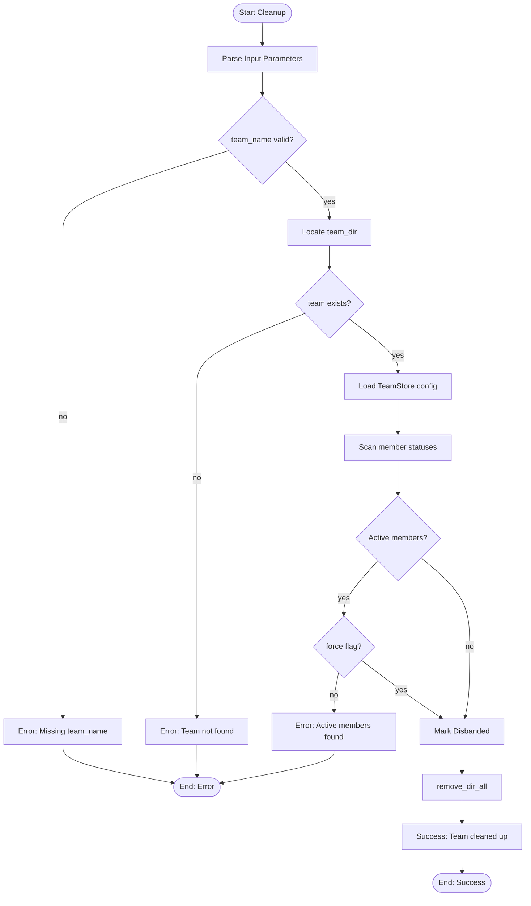

# TeamCleanupTool

**Type:** technology

### From: team_cleanup

TeamCleanupTool is a specialized administrative utility within the ragent multi-agent framework, designed to safely decommission team resources from persistent storage. The tool serves as the final lifecycle stage in team management, complementing creation, configuration, and shutdown operations with a comprehensive teardown capability. Its implementation reflects careful attention to operational safety, incorporating multiple validation layers before permitting destructive filesystem operations.

The tool's architecture demonstrates sophisticated state management patterns. Before executing deletion, it performs a complete membership scan through the TeamStore configuration, identifying any members whose status deviates from MemberStatus::Stopped. This validation prevents accidental destruction of teams with active computational processes—a critical safeguard in systems where agents may be performing long-running tasks or maintaining external connections. The collected active member names are incorporated into error messages, providing operators with precise information needed to remediate blocking conditions.

The force parameter introduces controlled override capabilities for emergency scenarios. When enabled, the tool bypasses active member checks while still recording this exceptional condition in output metadata. This design acknowledges that operational reality sometimes requires immediate resource reclamation, such as during system recovery from inconsistent states or forced termination scenarios. The metadata capture ensures auditability even when normal safeguards are suspended.

The implementation includes a best-effort state transition to TeamStatus::Disbanded before filesystem deletion. This creates a persistent marker in the configuration store that survives until the final remove_dir_all operation, enabling external observers to detect in-progress cleanup operations. The ok() wrapper on the save operation acknowledges that this state marker is advisory—failure to persist the disbanded status does not prevent necessary cleanup from proceeding, prioritizing resource reclamation over strict state consistency in failure scenarios.

## Diagram

## External Resources

- [async-trait crate documentation for async trait implementation patterns](https://docs.rs/async-trait/latest/async_trait/) - async-trait crate documentation for async trait implementation patterns
- [anyhow crate documentation for ergonomic error handling in Rust](https://docs.rs/anyhow/latest/anyhow/) - anyhow crate documentation for ergonomic error handling in Rust
- [Rust standard library documentation for recursive directory removal](https://doc.rust-lang.org/std/fs/fn.remove_dir_all.html) - Rust standard library documentation for recursive directory removal

## Sources

- [team_cleanup](../sources/team-cleanup.md)
