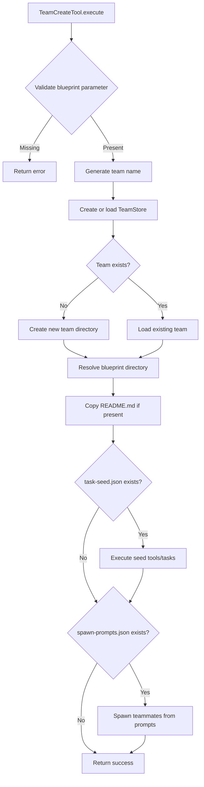

# TeamCreateTool

**Type:** technology

### From: team_create

The `TeamCreateTool` is a core component of the Ragent framework's team management subsystem, responsible for creating and initializing named agent teams. This tool encapsulates the complete lifecycle of team provisioning, from directory structure creation to automated teammate instantiation based on declarative blueprints. The implementation demonstrates sophisticated error handling and recovery patterns, including special handling for pre-existing teams through the `initialize_existing_without_config` pathway when configuration files are corrupted or missing.

The tool's design philosophy centers on convention-over-configuration principles while maintaining flexibility through optional parameters. Team names can be explicitly provided or auto-generated from blueprint names combined with timestamps, ensuring uniqueness while preserving human readability. The `project_local` boolean parameter enables teams to be scoped either to the current project directory (stored in `.ragent/teams/`) or to the user's global configuration (stored in `~/.ragent/teams/`), supporting both isolated project workflows and reusable team templates across projects.

Beyond basic directory creation, `TeamCreateTool` implements a sophisticated blueprint application system that processes multiple configuration files. The `README.md` copying mechanism preserves documentation from blueprints, while `task-seed.json` enables automated execution of setup tools or direct task creation. The `spawn-prompts.json` processing represents the most complex functionality, supporting multiple argument formats (nested `args` objects or flattened key-value pairs) and automatically injecting contextual information like team names and work context into spawn prompts. This enables teams to be created with fully configured, context-aware teammates ready to begin collaborative work immediately upon creation.

## Diagram

## External Resources

- [async-trait crate documentation for async trait implementations in Rust](https://docs.rs/async-trait/latest/async_trait/) - async-trait crate documentation for async trait implementations in Rust
- [Serde serialization framework documentation for JSON handling](https://serde.rs/) - Serde serialization framework documentation for JSON handling
- [Anyhow error handling library for flexible error propagation](https://docs.rs/anyhow/latest/anyhow/) - Anyhow error handling library for flexible error propagation

## Sources

- [team_create](../sources/team-create.md)
