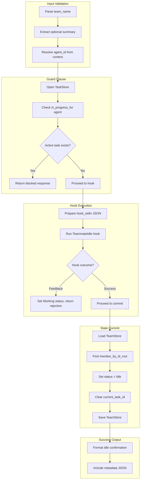

# TeamIdleTool

**Type:** technology

### From: team_idle

The `TeamIdleTool` is a core component of the ragent framework's team management subsystem, implemented as a zero-sized struct that provides the `team_idle` capability to AI agents participating in collaborative workflows. Structurally, it follows the typestate pattern common in Rust systems programming—containing no fields itself, yet encapsulating complete behavior through its trait implementation. This design choice reflects the tool's purely functional nature: it transforms input parameters and system state into side effects and output messages without maintaining internal mutable state. The tool is instantiated once and shared across concurrent agent executions, with all contextual data (team membership, working directory, session identity) passed through the `ToolContext` parameter.

The tool's significance lies in its role as the formal termination point for an agent's active work cycle within a team context. Without such a mechanism, distributed agent systems face the fundamental challenge of determining when participants have truly completed their responsibilities—a problem exacerbated by the non-deterministic nature of AI agent execution. The `TeamIdleTool` solves this by creating an explicit protocol handshake: the agent signals completion intent, the system validates preconditions (no stranded in-progress tasks), optional hooks execute business-specific validation, and finally the authoritative state is committed to persistent storage. This transforms an implicit 'probably done' condition into an explicit, auditable state transition with full provenance tracking.

Historically, the design reflects lessons from earlier workflow orchestration systems that permitted agents to simply exit or disconnect, leading to the 'zombie task' problem where work items remained assigned to non-existent or idle agents. The guard clause checking `in_progress_for` before allowing idle state transition directly addresses this anti-pattern. The tool's placement within the `ragent-core::tool::team_idle` module indicates its position in a broader taxonomy of team coordination primitives, alongside presumably complementary tools for task claiming (`team_task_claim`), task completion (`team_task_complete`), and potentially team joining or leaving operations. The `team:communicate` permission category suggests future extensibility toward role-based access control for team operations.

## Diagram

## External Resources

- [serde_json documentation for JSON value handling and serialization](https://docs.rs/serde_json/latest/serde_json/) - serde_json documentation for JSON value handling and serialization
- [anyhow crate for ergonomic error handling in Rust](https://docs.rs/anyhow/latest/anyhow/) - anyhow crate for ergonomic error handling in Rust
- [async-trait crate enabling async methods in traits](https://rust-lang.github.io/async-trait/) - async-trait crate enabling async methods in traits

## Sources

- [team_idle](../sources/team-idle.md)
