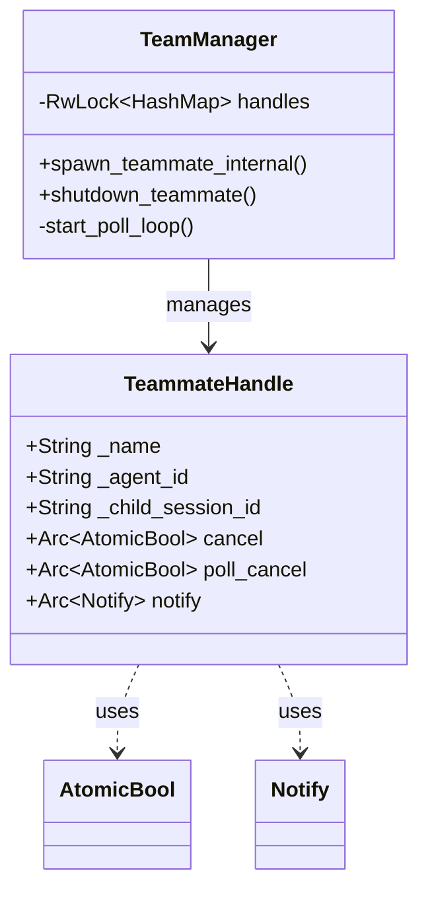

# TeammateHandle

**Type:** technology

### From: manager

The `TeammateHandle` struct represents the runtime state of an individual teammate within a managed team, serving as the private internal abstraction that `TeamManager` uses to track and control active agent instances. Unlike the persistent `TeamMember` configuration stored on disk, the handle captures ephemeral runtime information essential for operational management: the friendly display name (e.g., "security-reviewer"), the system-generated agent ID (e.g., "tm-001"), and the child session ID that the agent loop uses for its exclusive session with the `SessionProcessor`.

The struct's most critical fields are its synchronization primitives for lifecycle management. The `cancel: Arc<AtomicBool>` flag provides a cooperative cancellation mechanism—when set to true, the teammate's agent loop receives the signal to terminate gracefully after completing its current operation. A separate `poll_cancel: Arc<AtomicBool>` enables independent control of the mailbox polling task, allowing for fine-grained shutdown sequences where message processing ceases before the agent itself terminates. The `notify: Arc<Notify>` field implements a push-based wakeup pattern: when new messages arrive in the mailbox, the notifier triggers immediate poll loop iteration rather than waiting for the next 500ms interval, significantly improving latency for time-sensitive team coordination.

The handle's design reflects careful separation of concerns between identification (name, agent_id), session binding (child_session_id), and control plane signaling (cancel, poll_cancel, notify). All synchronization primitives use `Arc` for shared ownership across async tasks, with `AtomicBool` for lock-free cancellation checks and `Notify` for efficient async condition signaling. This architecture enables `TeamManager` to maintain thousands of concurrent teammates with minimal per-agent overhead while preserving the ability to rapidly terminate individual agents or the entire team.

## Diagram

## Sources

- [manager](../sources/manager.md)
