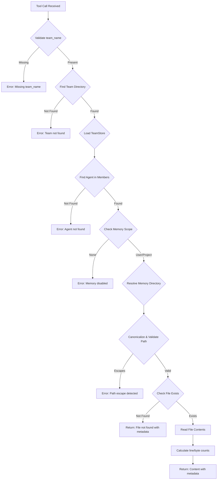

# TeamMemoryReadTool

**Type:** technology

### From: team_memory_read

TeamMemoryReadTool is a Rust struct implementing the Tool trait that provides secure file reading capabilities from agent persistent memory directories. This component serves as a fundamental building block in multi-agent systems, enabling individual agents to recall prior context and maintain state across discrete execution sessions. The tool implements a comprehensive security model including path canonicalization to prevent directory traversal attacks, team membership validation to ensure agents only access authorized memory scopes, and configurable memory visibility levels.

The implementation leverages Rust's type system and error handling patterns to provide robust operation in production environments. It integrates with a TeamStore configuration system that manages agent teams, their members, and associated permissions. The tool's design reflects careful consideration of multi-tenant security requirements, where agents from different teams or with different permission levels must be properly isolated. Default behavior falls back to reading MEMORY.md when no specific path is provided, establishing a conventional file for agent self-documentation.

As part of a larger tool ecosystem, TeamMemoryReadTool follows established patterns for parameter schemas using JSON Schema, asynchronous execution via async-trait, and structured output with metadata. The permission category `team:communicate` indicates its role in inter-agent and intra-agent communication mechanisms. This component demonstrates how traditional filesystem operations must be adapted and secured when deployed in AI agent contexts where automatic code execution and path construction create elevated security risks.

## Diagram

## External Resources

- [anyhow crate for flexible error handling in Rust](https://docs.rs/anyhow/latest/anyhow/) - anyhow crate for flexible error handling in Rust
- [async-trait crate for async trait methods in Rust](https://docs.rs/async-trait/latest/async_trait/) - async-trait crate for async trait methods in Rust
- [serde_json for JSON serialization and Value types](https://docs.rs/serde_json/latest/serde_json/) - serde_json for JSON serialization and Value types

## Sources

- [team_memory_read](../sources/team-memory-read.md)
