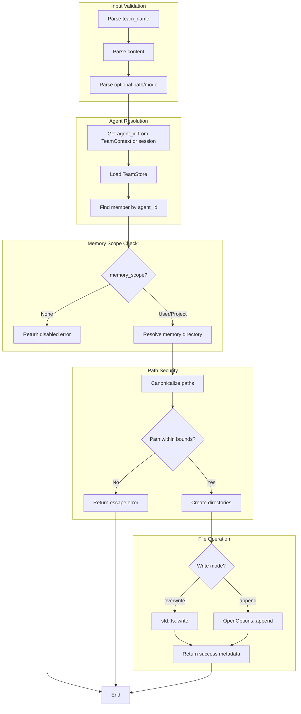

# TeamMemoryWriteTool

**Type:** technology

### From: team_memory_write

TeamMemoryWriteTool is a concrete implementation of the Tool trait in the ragent agent framework, specifically designed to provide persistent memory capabilities for AI agents operating within team contexts. This struct represents a critical infrastructure component that enables stateful agent interactions by allowing agents to write and append information to files that persist across sessions. The tool is intentionally designed as a zero-sized type (unit struct) with no fields, relying entirely on its method implementations and the ToolContext parameter passed during execution to access necessary runtime state.

The implementation demonstrates sophisticated handling of multi-agent security boundaries. When executing, the tool first resolves the calling agent's identity through the TeamContext, falling back to session-level identifiers when team context is unavailable. It then performs a lookup against the team's configuration to determine memory scope settings—whether memories should be isolated per-agent or shared project-wide. This design enables flexible deployment scenarios where agents might operate with varying levels of persistence and isolation depending on their assigned roles and the team's security posture.

Path security is a paramount concern in this implementation, addressed through multiple layers of validation. The tool canonicalizes both the memory directory and target file paths, then verifies that the resolved path remains within the canonical memory directory boundary. This prevents directory traversal attacks where maliciously crafted paths (e.g., '../../../etc/passwd') might attempt to escape the sandbox. The implementation also gracefully handles path creation, automatically establishing parent directories as needed while maintaining security invariants throughout the process.

## Diagram

## External Resources

- [Rust std::fs::OpenOptions - used for append mode file operations](https://doc.rust-lang.org/stable/std/fs/struct.OpenOptions.html) - Rust std::fs::OpenOptions - used for append mode file operations
- [anyhow crate - flexible error handling used throughout the implementation](https://docs.rs/anyhow/latest/anyhow/) - anyhow crate - flexible error handling used throughout the implementation
- [serde_json - JSON serialization for tool parameters and metadata](https://docs.rs/serde_json/latest/serde_json/) - serde_json - JSON serialization for tool parameters and metadata

## Sources

- [team_memory_write](../sources/team-memory-write.md)
