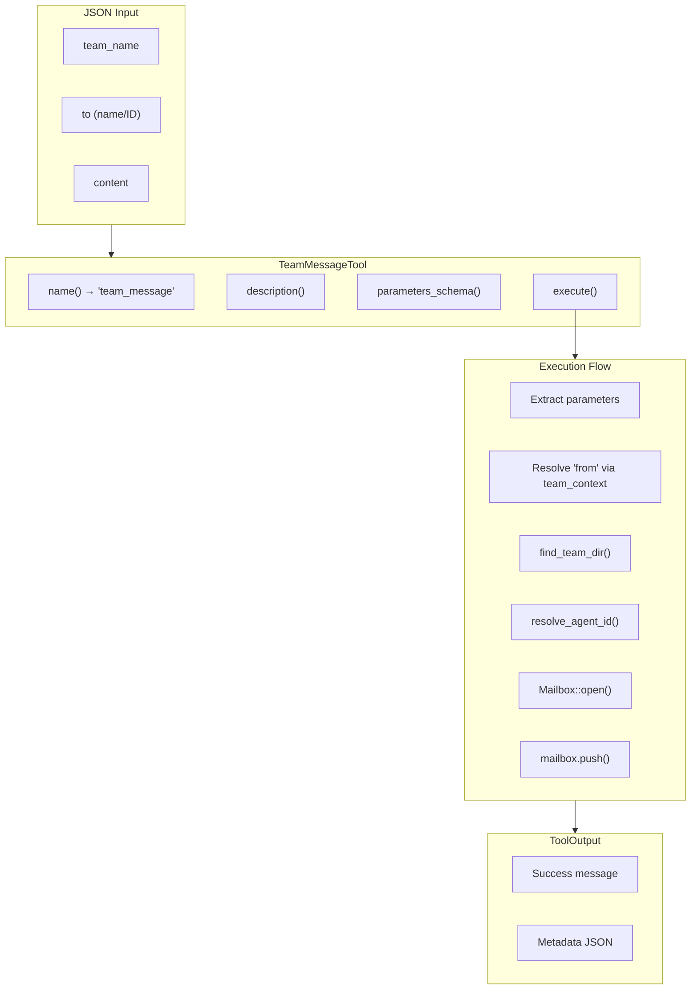

# TeamMessageTool

**Type:** technology

### From: team_message

TeamMessageTool is a concrete implementation of a messaging tool within a Rust-based multi-agent framework. It serves as the primary interface for agent-to-agent communication, encapsulating the logic required to send direct messages between team members. The struct itself is a zero-sized type (unit struct), containing no fields but implementing rich behavior through its `Tool` trait implementation. This design follows the type class pattern common in Rust, where behavior is separated from state, allowing tools to be instantiated cheaply and configured entirely through their trait methods.

The tool's architecture reflects careful separation of concerns: schema definition through `parameters_schema`, permission categorization via `permission_category`, and execution logic in the `execute` method. The JSON schema it returns defines a strict contract for callers, requiring three string fields and providing descriptive metadata that could be consumed by UI generators or API documentation systems. The "team:communicate" permission category suggests integration with a capability-based security model, where tools are gated by fine-grained permissions rather than coarse roles.

In production contexts, TeamMessageTool would likely participate in a larger orchestration system where agents discover available tools through reflection or registration mechanisms. Its async execution model, indicated by the `async_trait` macro, allows for non-blocking I/O operations when accessing team directories and mailboxes. The tool's design anticipates failure modes common in distributed systems: missing parameters, invalid team names, unresolvable recipients, and filesystem errors, each handled with contextual error messages through the `anyhow` crate's ergonomic error handling.

## Diagram

## External Resources

- [async-trait crate documentation for asynchronous trait methods in Rust](https://docs.rs/async-trait/latest/async_trait/) - async-trait crate documentation for asynchronous trait methods in Rust
- [anyhow crate for flexible error handling in Rust applications](https://docs.rs/anyhow/latest/anyhow/) - anyhow crate for flexible error handling in Rust applications
- [Serde serialization framework for Rust](https://serde.rs/) - Serde serialization framework for Rust

## Sources

- [team_message](../sources/team-message.md)
