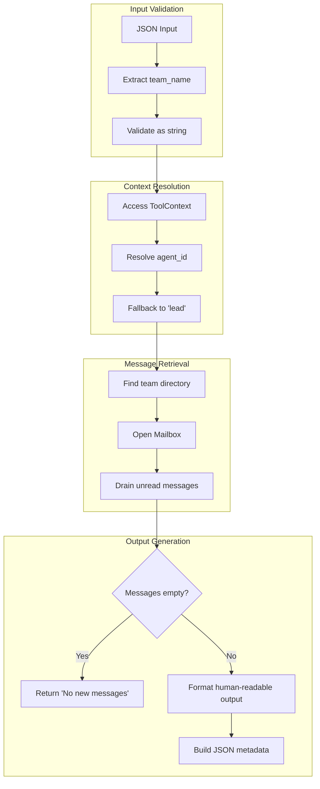

# TeamReadMessagesTool

**Type:** technology

### From: team_read_messages

TeamReadMessagesTool is a concrete implementation of the Tool trait within the ragent-core framework, specifically designed to facilitate inter-agent communication in multi-agent AI systems. This struct represents a callable capability that allows an agent to poll its designated mailbox for pending messages, retrieve their contents, and mark them as consumed. The tool operates within a structured permission model, categorized under "team:communicate", which governs access to team-based communication resources. Its architecture follows the command pattern, encapsulating the message retrieval logic within a reusable, testable component that adheres to a standardized interface contract. The implementation demonstrates sophisticated error handling through the anyhow crate, providing rich context for failure scenarios such as missing team directories or invalid parameter configurations.

The tool's execution flow reveals careful attention to the operational semantics of message consumption. When invoked, it first extracts and validates the team_name parameter from the input JSON, then resolves the calling agent's identity through the ToolContext. This context-aware design allows the tool to function correctly whether invoked by a named agent or the system lead. The actual message retrieval delegates to the Mailbox abstraction, which handles the low-level filesystem operations and ensures atomic draining of unread messages. This atomicity guarantee is crucial for preventing race conditions in concurrent agent environments where multiple processes might attempt to read from the same mailbox simultaneously.

The output formatting strategy employed by TeamReadMessagesTool serves dual purposes: generating human-readable summaries for direct agent consumption and producing structured JSON metadata for downstream processing. The human-readable format includes message provenance (sender identity), temporal information (UTC timestamps), message classification (type annotations), and content payload, separated by visual delimiters. The JSON representation preserves these fields in a machine-parseable structure, enabling sophisticated message routing, logging, and analysis workflows. This dual-output approach reflects the tool's role in a larger ecosystem where agents must both comprehend messages autonomously and provide transparent audit trails of their communications.

## Diagram

## External Resources

- [Serde JSON serialization framework used for structured data handling](https://serde.rs/) - Serde JSON serialization framework used for structured data handling
- [Anyhow error handling library for idiomatic Rust error propagation](https://docs.rs/anyhow/latest/anyhow/) - Anyhow error handling library for idiomatic Rust error propagation
- [Async-trait procedural macro enabling async methods in traits](https://docs.rs/async-trait/latest/async_trait/) - Async-trait procedural macro enabling async methods in traits

## Sources

- [team_read_messages](../sources/team-read-messages.md)
