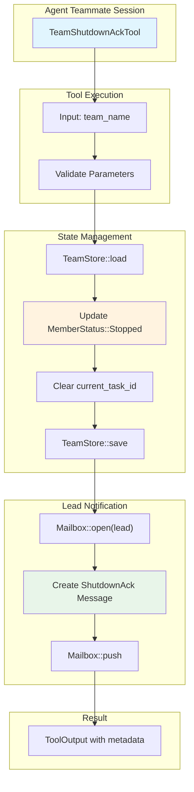

# TeamShutdownAckTool

**Type:** technology

### From: team_shutdown_ack

TeamShutdownAckTool is a Rust struct that implements the Tool trait to provide graceful shutdown acknowledgment functionality in a multi-agent coordination system. The tool serves as a critical component in the agent lifecycle management infrastructure, allowing individual agent teammates to formally respond to shutdown requests initiated by a team lead. When executed, it performs two primary operations: updating the agent's persistent status in the team configuration store to 'Stopped', and sending an acknowledgment message to the lead's mailbox to confirm the shutdown.

The implementation leverages Rust's async_trait crate to define asynchronous behavior, enabling non-blocking I/O operations when persisting state and sending messages. The tool follows a structured approach to parameter validation, requiring a 'team_name' parameter that identifies which team context the shutdown acknowledgment applies to. This design supports scenarios where a single agent might participate in multiple teams simultaneously, ensuring that shutdown signals are properly scoped and routed.

The tool's integration with the broader team management ecosystem is evident in its dependencies on TeamStore for persistent configuration management, Mailbox for inter-agent communication, and MemberStatus for state tracking. By clearing the current_task_id when marking a member as stopped, the tool ensures clean task state management and prevents orphaned task assignments. The detailed metadata returned in the ToolOutput provides observability into the shutdown process, including the agent identifier, team name, and final status, which is valuable for debugging and audit logging in production multi-agent deployments.

## Diagram

## External Resources

- [async-trait crate documentation for implementing async methods in traits](https://docs.rs/async-trait/latest/async_trait/) - async-trait crate documentation for implementing async methods in traits
- [serde.rs - Serialization framework used for JSON schema and metadata handling](https://serde.rs/) - serde.rs - Serialization framework used for JSON schema and metadata handling

## Sources

- [team_shutdown_ack](../sources/team-shutdown-ack.md)
