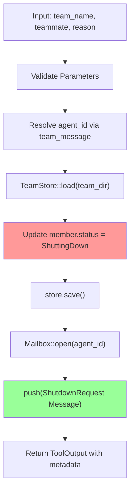

# TeamShutdownTeammateTool

**Type:** technology

### From: team_shutdown_teammate

TeamShutdownTeammateTool is a specialized tool implementation in the ragent-core framework designed to coordinate graceful shutdown of teammate agents within a multi-agent team structure. This struct implements the Tool trait and provides the core functionality for lead agents to initiate controlled termination of subordinate agents, ensuring proper state management and communication protocols are followed. The tool operates through a multi-phase process: first validating input parameters including team_name and teammate identifier, then resolving the agent_id through the team_message module's resolution logic, updating persistent team state via TeamStore to mark the member as ShuttingDown, and finally queuing a ShutdownRequest message in the target's Mailbox. This careful sequencing prevents race conditions and ensures the teammate receives notification before any termination actions occur.

The tool's architecture reflects lessons from distributed systems design, where abrupt termination of components can lead to data loss, incomplete transactions, or orphaned resources. By requiring an explicit shutdown request and subsequent acknowledgment (via team_shutdown_ack), the system maintains eventual consistency and allows for proper cleanup sequences. The tool integrates deeply with the framework's permission system through its 'team:manage' category, ensuring that only authorized lead agents can trigger shutdowns—a critical security boundary in production multi-agent deployments where unauthorized termination could disrupt ongoing operations or compromise mission-critical tasks.

Implementation details reveal sophisticated Rust patterns including the use of async_trait for asynchronous trait implementation, serde_json for structured parameter schemas that enable dynamic validation, and the anyhow crate for ergonomic error propagation. The execute method demonstrates careful resource management with explicit scoping for the TeamStore mutable borrow, ensuring the store is dropped before subsequent mailbox operations. This prevents potential deadlocks or borrow checker issues in async contexts. The tool also provides rich metadata in its ToolOutput, enabling upstream systems to track shutdown state transitions and correlate acknowledgments with original requests, essential for observability in complex agent orchestration scenarios.

## Diagram

## External Resources

- [anyhow crate documentation for ergonomic error handling in Rust](https://docs.rs/anyhow/latest/anyhow/) - anyhow crate documentation for ergonomic error handling in Rust
- [serde serialization framework for Rust struct handling](https://serde.rs/) - serde serialization framework for Rust struct handling
- [async-trait crate for async trait implementations](https://crates.io/crates/async-trait) - async-trait crate for async trait implementations

## Sources

- [team_shutdown_teammate](../sources/team-shutdown-teammate.md)
