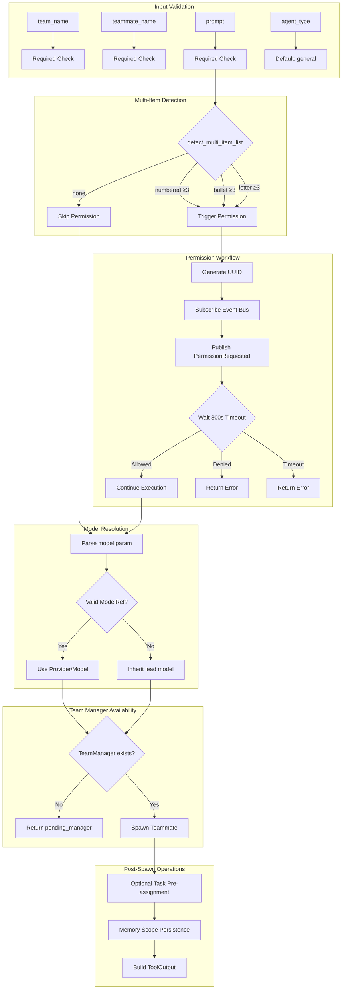

# TeamSpawnTool

**Type:** technology

### From: team_spawn

The `TeamSpawnTool` is the central struct defined in this source file, implementing the `Tool` trait to provide teammate spawning capabilities within a multi-agent system. It represents a concrete instantiation of the framework's plugin architecture, allowing dynamic agent creation with configurable parameters including team membership, agent specialization, task assignment, and memory persistence scopes. The struct itself is minimal—essentially a unit struct—demonstrating the trait-based design pattern where behavior is composed through trait implementations rather than encapsulated state.

The tool's implementation spans multiple critical responsibilities: parameter schema definition through JSON Schema, permission category classification for access control, and the core `execute` method that orchestrates the entire teammate lifecycle. The design philosophy emphasizes fail-safe operation with graceful degradation, as evidenced by the explicit handling of missing `TeamManager` infrastructure during the M3 milestone transition period. This pattern of staging functionality behind feature flags or infrastructure availability is common in rapidly evolving AI agent frameworks.

The `TeamSpawnTool` integrates with numerous subsystem components including the event bus for permission workflows, the team manager for agent lifecycle operations, task stores for work item assignment, and team stores for persistent configuration management. Its execution flow demonstrates sophisticated control patterns: synchronous validation, asynchronous permission negotiation with timeout handling, optional model resolution, memory scope configuration, and finally conditional task pre-assignment. The comprehensive tracing instrumentation at all severity levels (`info`, `debug`, `trace`, `warn`, `error`) indicates production-hardened observability practices essential for debugging distributed multi-agent interactions.

## Diagram

## External Resources

- [Tokio graceful shutdown patterns for async runtime management](https://tokio.rs/tokio/topics/shutdown) - Tokio graceful shutdown patterns for async runtime management
- [serde_json documentation for JSON handling in Rust](https://serde.rs/json.html) - serde_json documentation for JSON handling in Rust

## Sources

- [team_spawn](../sources/team-spawn.md)
